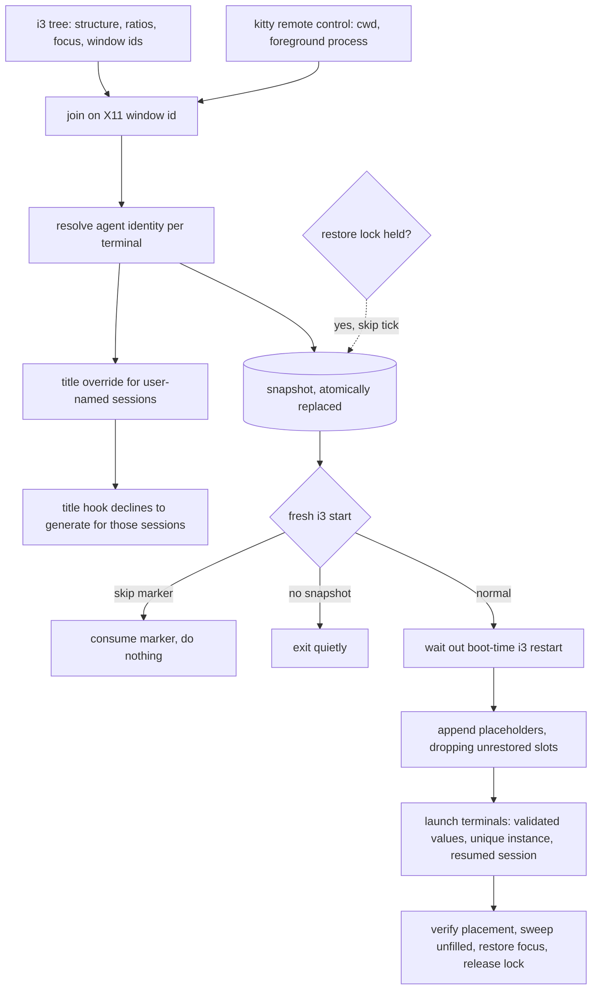

# i3 Session Restore - Plan

## Goal Capsule

- **Objective:** After a reboot or a crash, bring back the i3 session that was on screen — the workspace container tree, each terminal's working directory, and the Claude Code or codex session that was running inside it. While a session runs, show the name the user gave it in the terminal title.
- **Product authority:** This plan owns capture and restore of kitty terminals, plus the live session-title override. Per-app workspace placement for Spotify and the chat apps already exists in `home/.config/i3/config` and `home/.config/i3/scripts/ws10-layout`; this plan preserves that machinery rather than replacing it.
- **Execution profile:** Two new bash scripts, two i3 autostart lines, a gate added to the existing Claude Code title hook, and one fixture test. No new runtime dependency. **Authoring side matters:** i3 runs `~/.config/i3/scripts/` and reads `~/.config/i3/config`, and `sync.sh` copies those live paths *into* the repo — so every script and config change is authored live and pulled into the repo by `sync.sh` before committing. A repo-only edit is destroyed by the next sync.
- **Stop conditions:** Stop and ask if restoring would require editing `home/.zshrc`, or if the snapshot format would need to carry anything beyond layout, focus, directory, and session identity.
- **Tail ownership:** Commit to `main` in this repo. No PR. The user pushes. The reboot and skip gates are user-run after the commit.

**Product Contract preservation:** changed — R7 and R8 replaced the wrapper-minted session-ID mechanism with the CLI's own live session record (KTD1); R2 extended to record focus; R6's rationale corrected; R8 keyed on directory *and* account; R18's second clause corrected to name the existing title hook. R22 added for non-terminal leaves. R18–R21 added earlier for the session-title behavior. Product intent is unchanged throughout; each change closes a gap review found rather than moving scope.

---

## Product Contract

### Summary

A snapshot-and-restore pair for the i3 session. A watcher records the live container tree, which workspace has focus, each terminal's directory, and each terminal's agent session on an interval; at the next fresh i3 start a restore script rebuilds those workspaces and brings the agent sessions back live. The same watcher keeps a user-named session's name in its terminal title.

### Problem Frame

A crash, a dead battery, or a plain reboot ends a working session that took real effort to assemble. The cost is not the windows — it is the context. Terminals sit in specific worktrees, and several carry a long-running agent conversation whose history is the actual work product. Reconstructing that by hand means remembering which of four sessions in the same repository belonged to which task, then finding each one through a picker.

Nothing on the machine captures any of this today. `home/.config/i3/config` offers `restart` in place, which preserves a layout only while X keeps running; it does nothing across a power cycle. The one script that builds a multi-pane working environment, `home/.config/i3/scripts/project-launch`, constructs a single hardcoded shape for a project chosen from a picker — it has no notion of what was previously on screen.

The gap is widest exactly where the loss hurts most: an agent session is addressable by ID for as long as someone knows the ID, and after a crash nobody does.

A second, smaller irritation shares the same data. A session renamed with `/rename` keeps showing a generated conversation summary in its terminal title, so a deliberately named session is no easier to find in a row of tabs than an anonymous one. That summary comes from the existing Claude Code title hook, not from the CLI itself — which is where the override has to act.

### Key Decisions

- KD1. **Auto-resume agent sessions live at boot** (session-settled: user-directed — chosen over pre-typing the resume command or restoring the directory only: the restore should need no keystrokes). Governs R13.
- KD2. **No canonical layout** (session-settled: user-directed — the layout differs from session to session, so there is no fixed shape to template). Every snapshot captures the tree that is actually present and replays that. Governs R2, R11.
- KD3. **Snapshot on an interval rather than at shutdown.** A crash or a dead battery never runs a clean exit path, which is the case the feature exists for. Governs R1.
- KD4. **Terminals only.** Chat and music apps already land on their workspaces declaratively, and duplicating that would produce competing placement logic. Governs R16, R22.
- KD5. **A user-set session name wins over the generated summary** (session-settled: user-directed — chosen over leaving the generated summary in place: a name the user chose is what makes the window findable). Governs R19.

### Requirements

**Capture**

- R1. A watcher records session state on an interval, so an unclean shutdown loses at most one interval of change.
- R2. The snapshot records each workspace's full container tree — nesting, split direction, tabbed and stacked containers, split ratios — and which workspace held focus.
- R3. The snapshot records each captured terminal's working directory.
- R4. For a terminal running an agent, the snapshot records which agent it is, that session's identity, and — for Claude Code — which account configuration the session belongs to.
- R5. Snapshot state survives a reboot, is readable only by its owner, and is never committed to this repo.
- R6. Scratchpad terminals are excluded from capture, because i3 owns them as scratchpad windows rather than as part of the tiled layout.
- R7. A running Claude Code session's identity comes from the CLI's own live session record, matched to the live process rather than to its process id alone.
- R8. When no live record is readable, identity falls back to the most recent session recorded on disk for that directory *and* account, which restores the right set of sessions without guaranteeing which pane each returns to.
- R9. A codex session's identity is the id of the rollout the process opened as its own top-level session, not one of the subagent rollouts it also holds open.

**Restore**

- R10. Restore runs once per fresh i3 start, and only after the boot-time `theme-switch` restart-in-place has completed; neither an i3 reload nor a restart-in-place triggers it again.
- R11. Restore reproduces the captured tree for each workspace and places every terminal in the slot it occupied.
- R12. Each restored terminal opens at its captured working directory.
- R13. Each restored agent terminal resumes its captured session live, under the account that session belongs to, launched without any added permission bypass.
- R14. A terminal that held no agent returns as a plain shell at its captured directory.
- R15. A single boot can skip the restore without editing any configuration file.
- R16. Existing declarative placement for Spotify and the chat apps continues to work untouched.
- R17. A terminal that cannot be restored does not abort the rest of the restore, leaves no empty placeholder behind, and the failure is surfaced to the user.
- R22. A slot held by a window this feature does not restore is dropped rather than reproduced, and its siblings keep their captured proportions.

**Session title**

- R18. A Claude Code session the user named shows that name as its terminal title; a session named by the title hook keeps its hook-generated title.
- R19. The name persists for the life of the session rather than being replaced by the next hook-generated summary.
- R20. When a named session ends, its terminal stops claiming that name.
- R21. Renaming a session updates its terminal title within a few seconds, without waiting for the next snapshot and without a restart.

### Key Flows

- F1. Snapshot tick
  - **Trigger:** The watcher's interval elapses and no restore is in progress.
  - **Steps:** Read the live container tree and the focused workspace; read each kitty window's directory and foreground process, excluding scratchpad classes; resolve an agent session identity for each terminal that has one; write a complete snapshot that atomically replaces the previous one.
  - **Outcome:** One current snapshot on disk, in a location that survives a reboot.
  - **Covers R1, R2, R3, R4, R5, R6.**

- F2. Restore at fresh i3 start
  - **Trigger:** i3 starts fresh, the restore hook fires, and the boot-time `theme-switch` restart-in-place has completed.
  - **Steps:** Claim the restore-in-progress lock; read and validate the snapshot; for each captured workspace append the captured tree as placeholders, dropping slots for windows this feature does not restore; launch each terminal at its directory with its agent session and account; confirm each landed in its slot; sweep any placeholder left unfilled; restore the captured focused workspace; release the lock.
  - **Outcome:** The workspaces are back with their layout, directories, and live agent sessions.
  - **Covers R10, R11, R12, R13, R14, R17, R22.**

- F3. Skipped restore
  - **Trigger:** The skip marker exists when the restore hook fires.
  - **Steps:** The restore consumes the marker, exits without launching anything, and leaves the snapshot in place.
  - **Outcome:** A clean login, with the snapshot still available for a later manual restore.
  - **Covers R15.**

- F4. Title follows the session name
  - **Trigger:** A snapshot tick observes a live Claude Code session whose name the user set.
  - **Steps:** Compare the session's name against the terminal's current title; when they differ, sanitize the name and set the terminal title, locking it against further writes. The title hook independently declines to generate a summary for that session.
  - **Outcome:** The window shows the user's chosen name until the session ends.
  - **Covers R18, R19, R21.**

### Acceptance Examples

- AE1. **Covers R7, R11, R13.** Given four Claude Code sessions running in one repository across two panes of a split and two panes of a stack, when the machine is rebooted and restored, then each pane returns with the same session it held.
- AE2. **Covers R8.** Given a terminal whose agent process exposes no live session record, when the session is restored, then a session from the correct directory and account is resumed and the imprecision is surfaced rather than presented as an exact match.
- AE3. **Covers R1, R5.** Given the battery dies with no clean shutdown, when the machine boots, then the layout from the most recent snapshot is restored.
- AE4. **Covers R10.** Given a restored session, when the theme script toggles and restarts i3 in place, then no second restore runs and no duplicate terminals appear.
- AE5. **Covers R15.** Given the skip marker is present at login, when the desktop comes up, then no terminals and no agents are launched, the snapshot is still on disk, and the next boot restores normally.
- AE6. **Covers R17.** Given a captured directory that no longer exists, such as a deleted worktree, when the restore runs, then that terminal's failure is reported, no empty pane is left on the workspace, and every other terminal still restores.
- AE7. **Covers R2, R11.** Given a workspace holding a two-pane vertical split beside a three-window stacked container at uneven widths, when it is restored, then the same nesting, orientation, container modes, and split ratios come back.
- AE8. **Covers R9.** Given a codex process holding several rollout files open, one of which is its own session and the rest subagent threads, when its identity is captured, then the top-level session is recorded and no subagent thread is.
- AE9. **Covers R18.** Given one Claude Code session the user renamed and one left with a hook-generated title, when a tick runs, then the renamed one shows the user's name and the other keeps its hook-generated title.
- AE10. **Covers R20.** Given a named session that exits, when the next tick runs, then its terminal no longer shows that session's name.
- AE11. **Covers R22.** Given a workspace whose tabbed container holds a browser beside a terminal, when it is restored, then the terminal returns at its captured proportion and no empty slot exists where the browser was.
- AE12. **Covers R16.** Given a snapshot restored at boot, when the desktop comes up, then Spotify and the chat apps still land on their declaratively assigned workspaces.
- AE13. **Covers R1, R10.** Given the watcher and the restore both start at login, when the restore is still waiting for the desktop to settle, then no tick overwrites the snapshot the restore is about to read.

### Scope Boundaries

- Browsers. They restore their own tabs, and workspace placement alone does not justify the added boot cost. Their slots are dropped per R22.
- Chat and music apps. Already placed declaratively; see KD4.
- Non-agent programs that were running in a pane. A terminal that held `vim` or `htop` returns as a shell at the right directory, not mid-command.
- kitty's own tabs and splits. Every kitty window on this machine currently holds a single pane, so there is no internal structure to capture.
- Multi-monitor layout restore. Only the internal display is in use; a snapshot taken with an external monitor attached and restored without it is out of scope.
- Floating window geometry.
- Per-account kitty themes. `project-launch` gives FNA and OWN terminals different themes; restored terminals come back on the default theme, losing that visual cue.
- A shell test framework. Neither `bats` nor `shellcheck` is installed and this repo has no test tooling; this plan adds a single fixture script, not a harness.

#### Deferred to Follow-Up Work

- A tunable snapshot interval or configurable state path, following the `home/.config/gcal-next.env.example` precedent.
- Snapshot history beyond the current one.
- A keybinding that arms the skip marker, mirroring the `$mod+slash` binding on `ws-toggle-icons`. The marker is armed by hand until then.
- A manual placeholder-sweep affordance for the case where the restore process dies between appending layouts and its own sweep.

### Dependencies / Assumptions

- kitty remote control stays enabled in `home/.config/kitty/kitty.conf` — both `allow_remote_control yes` and the per-process `listen_on` socket. Capture depends on it entirely; if it changes shape, every terminal captures as a plain shell, so the watcher checks at start and notifies rather than failing quietly. Note this socket is in the abstract namespace and carries no filesystem permissions, so any local process can already drive `kitty @`; this plan uses that channel but does not create the exposure.
- The CLI's live session record is an internal, undocumented surface carrying no account field. Each record carries the CLI version, so the watcher can recognise an unfamiliar shape and fall back to R8 rather than capturing nothing.
- `jq` is the JSON tool. `python3` on this machine resolves through pyenv shims whose active version changes, which makes it unsuitable for a boot-time script.
- The restore assumes the display is present and the boot-time `theme-switch` restart has completed, per R10.
- Whether `claude --resume <id>` keeps the same session id in the resumed process is not established. If it mints a new one, the post-restore snapshot diverges from the pre-reboot one; U3 confirms this against a live resume before U7 relies on it.
- Whether i3's restart-in-place preserves pending swallow placeholders is unverified. R10's gate keeps the restore clear of the known restart, so this matters only if another restart lands mid-restore.

### Sources / Research

Verified directly on this machine during planning rather than inferred:

- `append_layout` accepts hand-written layout JSON and restores nesting, container mode, and split ratios; a `percent` pair of 0.25/0.75 produced exactly 1:3 widths.
- Two kitty windows launched with distinct instance names were swallowed into their exact slots, in order, inside both a `splitv` and a `tabbed` container. Setting the instance leaves the class as `kitty`, so existing class-based window rules keep applying.
- `i3-save-tree` is unusable here — its `AnyEvent::I3` Perl module is absent. `perl-anyevent-i3` 0.19-3 exists in `extra` but is not needed under KTD2.
- Neither `exec` nor `exec_always` re-runs on an i3 reload; only `exec_always` re-runs on restart-in-place. `home/.config/i3/scripts/theme-switch` runs `i3-msg restart` unconditionally and is hooked at boot from `home/.config/i3/config`, so restart-in-place is routine rather than rare.
- An unfilled placeholder persists indefinitely and is a real X11 window; a non-empty `swallows` array is what distinguishes it from a real window, and killing it by container id spares its neighbours.
- kitty reports the X11 window id, which is the join key to the i3 tree; the i3 tree carries no process id at all.
- A live codex process held four rollout files open, only one of which reported itself as the top-level session; the newest file was a subagent thread, so a recency heuristic would resume the wrong conversation.
- A Claude Code session record marks a generated name with an explicit name-source field and omits that field entirely when the user set the name, verified across live sessions in both accounts.
- `~/.claude-{fna,own}/title-hook.sh` is wired as an async prompt hook in both accounts, generates a title with a small model, and writes it with the same locking kitty command this feature uses — which is why R18 names the hook and KTD15 gates it.
- This repo's remote is public, which is what makes committed fixtures a disclosure risk (KTD16).

Existing patterns to mirror:

- `home/.config/i3/scripts/resume-refresh` — long-running helper started once from the i3 config, with a debounce and a launch-then-verify retry loop.
- `home/.config/i3/scripts/ws10-layout` — the bounded poll-until-the-window-exists loop that breaks rather than exits on timeout. Note it also switches focus to workspace 10 at boot and issues a layout command on whatever is focused, so the restore must not be appending layouts while it runs.
- `home/.config/i3/scripts/project-launch` — launching kitty with an explicit account configuration and an agent as the command.
- `home/.config/i3/scripts/pomodoro` — PID-file plus liveness check.
- `home/.config/i3/scripts/theme-switch` — a script creating its own state directory under `~/.config/` at runtime.
- `home/.config/i3/scripts/dropdown-toggle` — detecting a failed i3 command from its JSON reply, and `& disown` for launches whose parent exits immediately.

---

## Planning Contract

### Key Technical Decisions

- KTD1. **Resolve agent identity from the CLI's own live session record** (session-settled: user-approved — chosen over minting UUIDs with `--session-id` inside the zsh `claude` wrapper: the record already exists, so a constantly-used shell function stays untouched). Governs R7, R8.
- KTD2. **Generate i3 layout JSON from the captured tree rather than shelling out to `i3-save-tree`.** The tool is unusable here and its output requires hand-editing anyway; generating avoids a new dependency. Governs R2, R11.
- KTD3. **Place each restored terminal by a unique instance name.** Setting the instance leaves the window class as `kitty`, so existing `for_window [class="kitty"]` rules keep applying. Governs R11.
- KTD4. **Sweep unfilled placeholders by container id, selected on a non-empty swallows array.** A workspace-wide kill would take real windows with it. Governs R17.
- KTD5. **Hook both scripts on plain `exec` lines; the restore proceeds only once the boot-time `theme-switch` restart has completed.** A plain `exec` never re-runs on reload or restart-in-place. The gate is a bounded poll for a live boot-time `theme-switch` process, following the `ws10-layout` poll idiom, that breaks and proceeds on timeout. Governs R10.
- KTD6. **Keep state in `~/.config/i3-session/`, created by the script at first run, mode 0700, with snapshots written under `umask 077`.** The i3 scripts directory is copied wholesale into this repo by `sync.sh`, so state there would commit worktree paths and session identifiers into a public repo; the mode matches the protection the CLI applies to the same identifiers. Governs R5.
- KTD7. **Express the skip affordance as a marker file in the KTD6 state directory that the restore consumes.** It matches the file-existence-as-state idiom in `home/.config/i3/scripts/ws-toggle-icons`, needs no config edit, and self-clears so a skip applies to one boot. The cited precedent supplies the idiom only, not its location — `/tmp` is tmpfs here and is cleared by the very reboot the marker must survive. Governs R15.
- KTD8. **Lock the terminal title when applying a user-set session name** (session-settled: user-approved — chosen over letting the generated summary keep overwriting it: the name has to survive the rest of the session to be useful). The name is stripped of control characters and length-capped before the write. Governs R19.
- KTD9. **Distinguish a user-set name from a generated one by the session record's own name-source field**, not by pattern-matching the name, and treat any value other than an explicit user-set marker as not-user-set. Governs R18.
- KTD10. **Write the snapshot atomically to a temporary file and rename it into place, every 30 seconds.** A crash mid-write must not leave a torn snapshot, which is the one input the restore cannot recover from; the interval sets R1's loss window. Governs R1, R5.
- KTD17. **Drive the title override off a change in the session records, not the snapshot cadence.** A rename is an interactive act, so a 30-second wait reads as broken. A short poll compares only the name fields across records — cheap, and blind to the constant status churn — and does the kitty work only when a name actually changed. The snapshot cadence still re-applies titles, so one lost to another writer heals without a rename. Governs R21.
- KTD11. **Use `jq` for all JSON handling.** It is the tool the existing i3 scripts already use, and it avoids the pyenv-shimmed `python3`. Governs R2, R3, R6.
- KTD12. **Serialise the watcher against the restore with a restore-in-progress lock in the KTD6 state directory.** Both scripts autostart together, so without it the watcher's first tick captures the empty boot desktop and atomically replaces the snapshot the restore is still waiting to read. The restore claims the lock before reading and releases it after its sweep; the watcher skips a tick without writing while the lock is held, and treats a lock older than a bounded timeout as stale. Governs R1, R10.
- KTD13. **Launch the resumed agent as the binary directly, with an explicit account configuration in its environment, never through an interactive login shell.** Mirrors `project-launch`. The zsh `claude` wrapper adds a permission-bypass flag on every branch and falls through to an interactive account prompt for directories outside the two project trees, which would both strip the agent's prompts and block the restore forever. Governs R13.
- KTD14. **Validate every snapshot value before use and pass values as separate arguments.** Session ids against a UUID pattern, directories as existing absolute paths, the account against the two known configuration directories, workspace names against i3's naming charset. The snapshot is a plain file that drives boot-time execution, and i3's command language accepts `exec`, so an unvalidated value interpolated into a command string is an execution path. Entries that fail are skipped and reported under R17. Governs R12, R13, R17.
- KTD15. **Gate the existing Claude Code title hook on the session's name-source.** The hook writes a generated title with the same locking kitty command this feature uses, so the watcher alone cannot win; the hook exits before generating when the record says the user named the session. Governs R18, R19.
- KTD16. **Hand-author the layout fixtures with synthetic values.** Captured fixtures would carry real worktree paths and session identifiers into a public git history permanently, and synthetic ones prove the same round-trip. Governs R11.

### High-Level Technical Design

Two loops share one data-gathering step and are serialised by a lock. The watcher joins two sources on the X11 window id, then fans out to the snapshot file and the title override. The restore reads only the snapshot.

### Sequencing and constraints

The restore competes with the boot sequence in two ways. `theme-switch` runs at boot and restarts i3 in place, so the restore holds off until that restart has completed (KTD5). `ws10-layout` also runs at boot, switches focus to workspace 10, and issues a layout command on whatever is focused — so the restore must not be mid-append while it runs; the same settle gate covers both, and the restore restores focus last.

The watcher and the restore share one file, and both start at login. KTD12's lock is what stops the watcher from destroying the snapshot the restore exists to read.

The watcher's single-instance guard exists for manual double-starts, not for restart-in-place — under a plain `exec` hook a restart cannot start a second watcher. The open trade-off is that a watcher which dies stays dead until the next login; `exec_always` plus the guard would self-heal on the next restart-in-place, at the cost of relying on the guard.

---

## Implementation Units

### U1. State directory and atomic writer

- **Goal:** Establish the state directory and the write primitive everything else depends on.
- **Requirements:** R5. Governed by KTD6, KTD10.
- **Dependencies:** none.
- **Files:** `~/.config/i3/scripts/session-snapshot` (new; pulled into `home/.config/i3/scripts/` by `sync.sh`).
- **Approach:** Create `~/.config/i3-session/` at first run, mode 0700, following `theme-switch`'s runtime `mkdir -p` idiom. Write every snapshot under `umask 077` to a temporary file in the same directory and rename it over the target, so a reader never observes a partial file.
- **Test scenarios:**
  - Writing a snapshot when the state directory does not exist creates it, mode 0700.
  - The written snapshot file is not group- or world-readable.
  - A reader that opens the snapshot mid-write sees either the previous complete snapshot or the new one, never a partial file.
  - Two writes in succession leave one snapshot and no temporary files.
- **Verification:** The state directory exists mode 0700 after one run, holds one snapshot with owner-only permissions, and no temporary files remain.

### U2. Capture the tree, focus, directories, and terminals

- **Goal:** Produce the snapshot's structural content.
- **Requirements:** R2, R3, R6. Governed by KTD11.
- **Dependencies:** U1.
- **Files:** `~/.config/i3/scripts/session-snapshot`.
- **Approach:** Walk the i3 tree per workspace, preserving nesting, split orientation, container mode, and split ratios, and record which workspace holds focus. Enumerate kitty processes and query each one's remote-control socket. Join tree leaves to kitty windows on the X11 window id, since the tree carries no process id. Exclude the three scratchpad kitty classes by name — `dropdown-terminal`, `dropdown-newsboat`, `slovodnia`. If no kitty socket answers, notify rather than silently recording every terminal as a plain shell.
- **Patterns to follow:** the recursive-descent tree walk with optional window-property access in `ws10-layout`; `notify-send` without an urgency flag for status.
- **Test scenarios:**
  - A workspace holding a nested split inside a stacked container round-trips its nesting, orientation, and container modes.
  - Uneven split ratios are captured as proportions, not pixel widths.
  - The focused workspace is recorded.
  - A terminal whose foreground process is an agent still reports the directory the agent runs in.
  - All three scratchpad classes are absent from the snapshot, including a `slovodnia` window that is showing at tick time.
  - A workspace with no terminals produces no terminal entries and does not fail the tick.
  - With no kitty socket reachable, the tick notifies and does not write a snapshot claiming every terminal is a plain shell.
- **Verification:** A snapshot of the current desktop names every non-scratchpad terminal with its correct directory, records the focused workspace, and matches the live tree in structure, mode, and ratios.

### U3. Resolve agent session identity

- **Goal:** Determine, per terminal, which agent session is running and how to resume it.
- **Requirements:** R4, R7, R8, R9. Governed by KTD1.
- **Dependencies:** U2.
- **Files:** `~/.config/i3/scripts/session-snapshot`.
- **Approach:** For a Claude Code process, read the CLI's live session record for that process id; confirm the record's process-start field matches the live process before trusting it, so a reused id cannot yield the wrong session. Take the account from that process's own environment rather than from which account directory held a matching record — the record carries no account field. Guard on the record's version and fall back to the most recent session for that directory *and* account when the shape is unfamiliar, marking the entry inexact. For codex, select the rollout whose own first-line record identifies it as the top-level session rather than a subagent thread. Detect the agent from the base name of the foreground process command, since it appears both bare and as an absolute path.
- **Execution note:** Build this against the live processes on the machine — several Claude sessions in one repository, and a codex process holding subagent rollouts open — since those are the cases naive implementations get wrong. Also confirm here whether a resumed session keeps its original id, since the Dependencies section flags that as unverified and U7 relies on it.
- **Test scenarios:**
  - Four Claude sessions in the same directory each resolve to their own distinct session identifier.
  - A session in the secondary account resolves to that account, taken from the process environment.
  - A record whose process-start does not match the live process is rejected rather than trusted.
  - An agent invoked by absolute path is detected as an agent.
  - A codex process holding several rollouts open resolves to its top-level session and not to any subagent thread.
  - A record with an unrecognised version falls back to the directory-and-account lookup and marks the entry inexact.
  - A terminal running neither agent is recorded as a plain shell.
- **Verification:** Every live agent terminal resolves to the session identifier its own record reports, under the account its process environment names, and the codex entry matches its top-level session.

### U4. Watcher loop, autostart, and locks

- **Goal:** Run capture on an interval, exactly once per session, without racing the restore.
- **Requirements:** R1. Governed by KTD5, KTD10, KTD12.
- **Dependencies:** U1, U2, U3.
- **Files:** `~/.config/i3/scripts/session-snapshot`, `~/.config/i3/config` (both pulled into `home/.config/i3/` by `sync.sh`).
- **Approach:** Loop on the KTD10 interval. Claim a PID file in the state directory and exit if a live instance holds it. Skip a tick without writing while the restore-in-progress lock is held, treating a lock past its timeout as stale. Add a plain `exec` autostart line in the existing autostart block.
- **Patterns to follow:** `pomodoro` for the PID-file plus liveness check; `resume-refresh` for the lifecycle of a helper started once from the i3 config.
- **Test scenarios:**
  - Starting the watcher twice leaves one running instance.
  - A stale PID file whose process is gone does not prevent a start.
  - A tick fired while the restore lock is held writes nothing and leaves the existing snapshot intact.
  - A lock older than the timeout is treated as stale and the tick proceeds.
  - The loop continues after a tick fails.
- **Verification:** One watcher runs after login; a second invocation exits; a restore in progress leaves the pre-reboot snapshot untouched until it completes.

### U5. Session title override

- **Goal:** Show a user-chosen session name in its terminal title, and stop the title hook from overwriting it.
- **Requirements:** R18, R19, R20, R21. Governed by KTD8, KTD9, KTD15.
- **Dependencies:** U3, U4.
- **Files:** `~/.config/i3/scripts/session-snapshot`, `~/.claude-fna/title-hook.sh`, `~/.claude-own/title-hook.sh` (the hooks are mirrored in the repo at `home/claude-code/{fna,own}/title-hook.sh`).
- **Approach:** On each tick, for every terminal with a live Claude Code session, read the session's name and name-source. Apply the name only when the record marks it user-set, treating any other value as not-user-set. Sanitize the name — strip control characters, cap the length — then set the title so the running program cannot overwrite it. Release the title when the session is gone. Separately, gate the title hook: it exits before generating a summary when the record says the user named the session, so the two mechanisms stop competing for the same locked title.
- **Test scenarios:**
  - A session the user renamed shows that name within one interval.
  - A session left with a generated name keeps its hook-generated title.
  - The title hook does not overwrite a user-set name on the next prompt.
  - Renaming a session again updates the title within seconds, not on the next snapshot.
  - A named session that exits leaves its terminal no longer showing the name.
  - A name containing control characters is written sanitized.
  - Applying the same name twice does not thrash the title.
  - A codex terminal's title is left alone.
- **Verification:** User-named sessions show their names and survive a subsequent prompt; a generated-name session is untouched; a rename lands within one interval.

### U6. Layout synthesis and its round-trip test

- **Goal:** Turn a captured tree into the layout i3 will swallow windows into, and prove it.
- **Requirements:** R11, R22. Governed by KTD2, KTD3, KTD16.
- **Dependencies:** U2.
- **Files:** `~/.config/i3/scripts/session-restore` (new; pulled into the repo by `sync.sh`), `tests/session-layout-roundtrip.sh` (new), `tests/fixtures/` (new).
- **Approach:** Convert each workspace's captured tree into a placeholder tree, preserving nesting, orientation, container mode, and ratios, and assigning every terminal slot a unique instance-name criterion. Drop slots held by windows this feature does not restore and renormalize their siblings' proportions, so no unfillable placeholder is ever created. Fixtures are hand-authored with synthetic directories and zero-filled identifiers per KTD16 — never captured from the live desktop.
- **Execution note:** Write the round-trip test first; this is the only part of the feature testable without a live desktop, and the assertion is exact.
- **Test scenarios:**
  - A nested split inside a stacked container produces the same nesting and modes.
  - Ratios survive the conversion as proportions.
  - Each terminal slot gets a distinct match criterion; no two collide.
  - A tabbed container holding a browser beside a terminal yields one terminal slot at its captured proportion and no slot for the browser.
  - A workspace with only unrestored windows produces no layout rather than an empty container.
  - A malformed or truncated snapshot is rejected with a clear message instead of a partial layout.
  - No fixture contains a real home path or a real session identifier.
- **Verification:** `bash tests/session-layout-roundtrip.sh` passes; breaking the generator on purpose makes it fail.

### U7. Restore driver

- **Goal:** Rebuild the workspaces and bring the sessions back.
- **Requirements:** R10, R12, R13, R14, R16, R17. Governed by KTD4, KTD5, KTD12, KTD13, KTD14.
- **Dependencies:** U6.
- **Files:** `~/.config/i3/scripts/session-restore`, `~/.config/i3/config` (both pulled into the repo by `sync.sh`).
- **Approach:** Exit quietly when no snapshot exists — the first boot after this lands has none. Wait out the boot-time `theme-switch` restart per KTD5. Claim the restore lock. Validate every snapshot value per KTD14. For each captured workspace append its generated layout, then launch each terminal with its unique instance name, its captured directory, and — where captured — its agent resumed as the binary directly with an explicit account in its environment per KTD13. Poll for placement with a bounded try count that breaks and continues, so one bad terminal cannot abort the rest. Sweep any placeholder still unfilled. Restore the captured focused workspace last, then release the lock. Report a partial restore. Add the autostart line as a plain `exec`.
- **Patterns to follow:** `ws10-layout` for the bounded poll; `project-launch` for launching kitty with an explicit account and an agent as its command; `dropdown-toggle` for detecting a failed i3 command and for `& disown`.
- **Test scenarios:**
  - With no snapshot on disk the restore launches nothing, reports nothing, and exits zero.
  - The restore begins only after the boot-time i3 restart, not before it.
  - A two-workspace snapshot restores both, each terminal in its captured slot.
  - Each restored terminal's shell starts in its captured directory.
  - An agent terminal comes back with its own session resumed, in the right account, launched without an added permission-bypass flag.
  - A terminal captured without an agent comes back as a plain shell.
  - A snapshot value failing validation is skipped and reported rather than executed.
  - A captured directory that no longer exists reports a failure, leaves no placeholder, and does not stop the remaining terminals.
  - A terminal that never appears has its placeholder swept.
  - After a restore, the captured focused workspace is focused.
  - Spotify and the chat apps still land on their own workspaces.
  - A snapshot referencing a workspace that no longer exists creates it rather than failing.
- **Verification:** After a reboot, the workspaces match the pre-reboot layout, every terminal is in its directory, agent sessions are live with prompts intact, focus is where it was, and no empty panes remain.

### U8. Skip affordance

- **Goal:** Let one boot come up without restoring.
- **Requirements:** R15. Governed by KTD7.
- **Dependencies:** U7.
- **Files:** `~/.config/i3/scripts/session-restore`.
- **Approach:** Check for the marker in the KTD6 state directory before doing any work; when present, consume it and exit, leaving the snapshot untouched so the next boot restores normally.
- **Patterns to follow:** the file-existence-as-state idiom in `ws-toggle-icons`, including cleanup — the idiom only, not its `/tmp` location.
- **Test scenarios:**
  - With the marker present, no terminals launch and the snapshot survives.
  - The marker is gone afterwards, so the following boot restores.
  - With no marker, the restore proceeds normally.
  - The marker survives a reboot.
- **Verification:** A boot with the marker comes up empty and leaves the snapshot in place; the next boot restores it.

### U9. Operator documentation

- **Goal:** Record how to operate the feature.
- **Requirements:** none directly.
- **Dependencies:** U1, U6, U8.
- **Files:** `docs/i3-session-restore.md` (new).
- **Approach:** Document the state directory, the skip marker and how to arm it by hand, the snapshot interval, and the title-override behavior. A feature-scoped doc under the existing `docs/` tree; this repo has no README and creating one is out of scope here.
- **Test scenarios:** `Test expectation: none -- documentation only.`
- **Verification:** The doc names the state path, the marker path, the interval, and the title behavior.

---

## Verification Contract

| Gate | Command or check | Applies to | Run by |
|---|---|---|---|
| Syntax | `bash -n` on both scripts and the fixture test | U1–U9 | agent |
| Layout round-trip | `bash tests/session-layout-roundtrip.sh` | U6 | agent |
| Fixture hygiene | No fixture or staged file contains a real home path or a real session identifier | U6 | agent |
| Live capture | One tick produces a snapshot whose tree, focus, directories, and session identities match the running desktop | U2, U3 | agent |
| Watcher idempotence | A second invocation exits; a held restore lock makes a tick write nothing | U4 | agent |
| Title behavior | User-named sessions show their names and survive a following prompt; a generated-name session is untouched; a rename lands within one interval; an ended session releases its title | U5 | agent |
| Sync fidelity | After `sync.sh`, the live and repo copies of both scripts and the i3 config are identical | U4, U7 | agent |
| Repo hygiene | `git status` after a sync shows no snapshot, marker, or state file staged | U1 | agent |
| Restore | A real reboot returns the layout, focus, directories, and live sessions, with no empty panes | U7 | **user** |
| Skip | A boot with the marker present launches nothing and preserves the snapshot | U8 | **user** |

There is no test framework in this repo and neither `bats` nor `shellcheck` is installed, so `bash -n` plus the fixture script are the mechanical gates; the rest are named checks. The Restore and Skip gates need a real reboot, which ends the implementing session, so the user runs them and reports back.

## Definition of Done

- Every requirement R1–R22 is either satisfied or explicitly deferred in Scope Boundaries.
- All agent-run Verification Contract gates pass.
- The snapshot round-trips the current desktop in the parts testable without a reboot: capture, then a dry restore against a scratch workspace.
- A partial failure degrades as specified in R17 — reported, no orphaned placeholder, other terminals unaffected.
- `home/.zshrc` is unchanged.
- No snapshot, marker, or state file is tracked by git, and no fixture carries a real path or identifier.
- Abandoned experimental code from approaches that did not pan out is removed, not left in the diff.
- Changes are committed to `main`. No PR is opened and nothing is pushed.
- The user-run Restore and Skip gates are reported back after the commit; a failure there reopens the work rather than blocking the commit.
