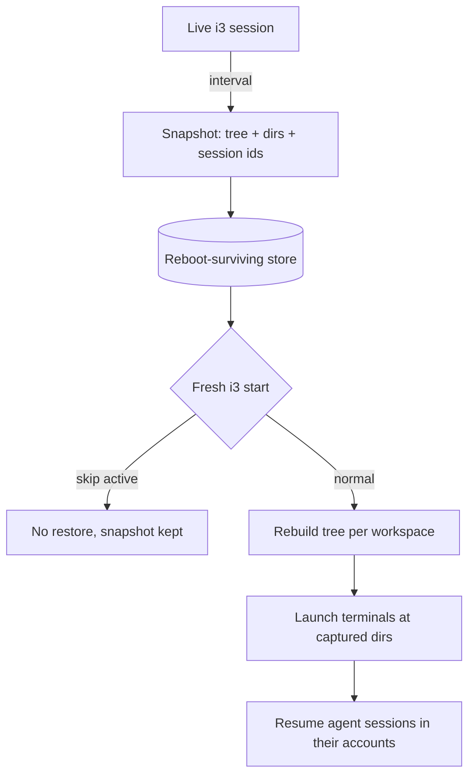

# i3 Session Restore - Plan

## Goal Capsule

- **Objective:** After a reboot or a crash, bring back the i3 session that was on screen — the workspace container tree, each terminal's working directory, and the Claude Code or codex session that was running inside it.
- **Product authority:** This plan owns capture and restore of kitty terminals. Per-app workspace placement for Spotify and the chat apps already exists in `home/.config/i3/config` and `home/.config/i3/scripts/ws10-layout`; this plan preserves that machinery rather than replacing it.
- **Open blockers:** None.

---

## Product Contract

### Summary

A snapshot-and-restore pair for the i3 session. A watcher records the live container tree, each terminal's directory, and each terminal's agent session on an interval; at the next fresh i3 start a restore script rebuilds those workspaces and brings the agent sessions back live.

### Problem Frame

A crash, a dead battery, or a plain reboot ends a working session that took real effort to assemble. The cost is not the windows — it is the context. Terminals sit in specific worktrees, and several carry a long-running agent conversation whose history is the actual work product. Reconstructing that by hand means remembering which of four sessions in the same repository belonged to which task, then finding each one through a picker.

Nothing on the machine captures any of this today. `home/.config/i3/config` offers `restart` in place, which preserves a layout only while X keeps running; it does nothing across a power cycle. The one script that builds a multi-pane working environment, `home/.config/i3/scripts/project-launch`, constructs a single hardcoded shape for a project chosen from a picker — it has no notion of what was previously on screen.

The gap is widest exactly where the loss hurts most: an agent session is addressable by ID for as long as someone knows the ID, and after a crash nobody does.

### Key Decisions

- KD1. **Auto-resume agent sessions live at boot** (session-settled: user-directed — chosen over pre-typing the resume command or restoring the directory only: the restore should need no keystrokes). Governs R13.
- KD2. **No canonical layout** (session-settled: user-directed — the layout differs from session to session, so there is no fixed shape to template). Every snapshot captures the tree that is actually present and replays that. Governs R2, R11.
- KD3. **Snapshot on an interval rather than at shutdown.** A crash or a dead battery never runs a clean exit path, which is the case the feature exists for. Governs R1.
- KD4. **Pin agent session identity at launch, not at capture.** A running `claude` exposes no session ID, so identity has to be established when the session starts. Governs R7, R8.
- KD5. **Hook the restore on a plain `exec` line.** In i3 4.25.1 neither `exec` nor `exec_always` re-runs on reload, and only `exec_always` re-runs on restart-in-place, so `exec` fires exactly once per fresh start with no guard of its own. Governs R10.
- KD6. **Reuse `project-launch`'s terminal-launch idiom, not its layout building.** Its themed-kitty-with-explicit-account launch is the right precedent; its imperative `i3-msg` split sequence only ever produces its own fixed shape and cannot express an arbitrary tree. Governs R11, R12, R13.
- KD7. **Terminals only.** Chat and music apps already land on their workspaces declaratively, and duplicating that would produce competing placement logic. Governs R16.

### Requirements

**Capture**

- R1. A watcher records session state on an interval, so an unclean shutdown loses at most one interval of change.
- R2. The snapshot records each workspace's full container tree: nesting, split direction, tabbed and stacked containers, and split ratios.
- R3. The snapshot records each captured terminal's working directory.
- R4. For a terminal running an agent, the snapshot records which agent it is, that session's identity, and — for Claude Code — which account configuration the session belongs to.
- R5. Snapshot state survives a reboot.
- R6. Scratchpad terminals are excluded from capture, because i3 launches them itself on every start.

**Session identity**

- R7. A Claude Code session launched through the shell wrapper has its session ID assigned at launch and recorded against the terminal it runs in.
- R8. A Claude Code session with no recorded ID is recovered best-effort from on-disk session files, which guarantees the correct set of sessions for a directory but not which pane each one returns to.
- R9. A codex session's identity is read from its rollout file's own id, not from the parent thread reference that a forked rollout also carries.

**Restore**

- R10. Restore runs once per fresh i3 start, and neither an i3 reload nor a restart-in-place triggers it again.
- R11. Restore reproduces the captured tree for each workspace and places every terminal in the slot it occupied.
- R12. Each restored terminal opens at its captured working directory.
- R13. Each restored agent terminal resumes its captured session live, under the account that session belongs to.
- R14. A terminal that held no agent returns as a plain shell at its captured directory.
- R15. A single boot can skip the restore without editing any configuration file.
- R16. Existing declarative placement for Spotify and the chat apps continues to work untouched.
- R17. A terminal that cannot be restored does not abort the rest of the restore, and the failure is surfaced to the user.

### Key Flows

- F1. Snapshot tick
  - **Trigger:** The watcher's interval elapses.
  - **Steps:** Read the live container tree; read each kitty window's directory and foreground process; resolve an agent session identity for each terminal that has one; write a complete snapshot that replaces the previous one.
  - **Outcome:** One current snapshot on disk, in a location that survives a reboot.
  - **Covers R1, R2, R3, R4, R5, R6.**

- F2. Restore at fresh i3 start
  - **Trigger:** i3 starts fresh and the restore hook fires.
  - **Steps:** Read the snapshot; for each workspace reconstruct the captured tree; launch each terminal at its directory, with its agent session and account where one was captured; place each terminal in its captured slot.
  - **Outcome:** The workspaces are back with their layout, directories, and live agent sessions.
  - **Covers R10, R11, R12, R13, R14, R17.**

- F3. Skipped restore
  - **Trigger:** The skip affordance is active when the restore hook fires.
  - **Steps:** The restore exits without launching anything and leaves the snapshot in place.
  - **Outcome:** A clean login, with the snapshot still available for a later manual restore.
  - **Covers R15.**

### Acceptance Examples

- AE1. **Covers R7, R11, R13.** Given four Claude Code sessions running in one repository across two panes of a split and two panes of a stack, all launched through the wrapper, when the machine is rebooted and restored, then each pane returns with the same session it held.
- AE2. **Covers R8.** Given a Claude Code session that was already running before session-ID pinning existed, when the session is restored, then a session from the correct directory is resumed and the imprecision is surfaced rather than presented as an exact match.
- AE3. **Covers R1, R5.** Given the battery dies with no clean shutdown, when the machine boots, then the layout from the most recent snapshot is restored.
- AE4. **Covers R10.** Given a restored session, when the i3 config is reloaded or i3 is restarted in place, then no second restore runs and no duplicate terminals appear.
- AE5. **Covers R15.** Given a boot where the restore is skipped, when the desktop comes up, then no terminals and no agents are launched, and the snapshot is still on disk.
- AE6. **Covers R17.** Given a captured directory that no longer exists, such as a deleted worktree, when the restore runs, then that terminal's failure is reported and every other terminal still restores.
- AE7. **Covers R2, R11.** Given a workspace holding a two-pane vertical split beside a three-window stacked container, when it is restored, then the same nesting, orientation, and container modes come back rather than a flat row of terminals.

### Scope Boundaries

- Browsers. They restore their own tabs, and workspace placement alone does not justify the added boot cost.
- Chat and music apps. Already placed declaratively; see KD7.
- Non-agent programs that were running in a pane. A terminal that held `vim` or `htop` returns as a shell at the right directory, not mid-command.
- kitty's own tabs and splits. Every kitty window on this machine currently holds a single pane, so there is no internal structure to capture.
- Multi-monitor layout restore. Only the internal display is in use; a snapshot taken with an external monitor attached and restored without it is out of scope for now.
- Floating window geometry.

### Dependencies / Assumptions

- kitty remote control is enabled in `home/.config/kitty/kitty.conf`, which is what makes a terminal's directory and foreground process readable at all. Turning it off disables capture.
- `/tmp` is tmpfs on this machine, so the snapshot cannot follow the existing convention of keeping script state there — every other script in `home/.config/i3/scripts/` does, and none of them needs to survive a reboot.
- The installed Claude Code CLI accepts an explicit session ID at launch, and the installed codex CLI resumes by session UUID.
- The `claude` shell wrapper in `home/.zshrc` is the normal launch path for interactive sessions. Sessions started by other means fall into the R8 fallback.
- New scripts under `home/.config/i3/scripts/` are copied wholesale by `sync.sh`, so this feature needs no change to the sync tooling.
- Pinning session IDs changes a wrapper used constantly, so its existing account-selection and flag-passing behavior must keep working unchanged.

### Outstanding Questions

**Deferred to Planning**

- The snapshot interval, and whether any snapshot history is kept beyond the current one.
- The mechanism for placing each terminal into its exact tree slot, given that every kitty window presents identical matching criteria by default.
- The form of the skip affordance: a marker file, a keybinding, or a timed prompt at boot.
- How far to take best-effort identity recovery for unpinned sessions before accepting arbitrary assignment within a directory.
- Whether the watcher rides in an existing long-running helper or gets its own process.

### Sources / Research

- `home/.config/i3/scripts/project-launch` — the launch precedent: chooses account config and theme per project category, then launches kitty with an explicit account and an agent as the command. Its `i3-msg` split sequence is the part that does not generalize.
- `home/.config/i3/scripts/ws10-layout` — existing per-boot workspace assembly, including the poll-until-the-window-exists idiom that any restore will also need.
- `home/.config/i3/config` — autostart conventions, the `for_window` placement rules for Spotify and the chat apps, and the reload and restart keybindings.
- `home/.config/i3/scripts/resume-refresh` — the closest existing pattern for a long-running watcher that reacts to system events, including its debounce and its launch-then-verify retry loop.
- `home/.zshrc` — the `claude` wrapper's account selection, and the existing kitty remote-control calls driven from shell hooks.
- `sync.sh`, `restore.sh` — how a new script under `home/.config/i3/scripts/` reaches the repo and gets deployed back.
