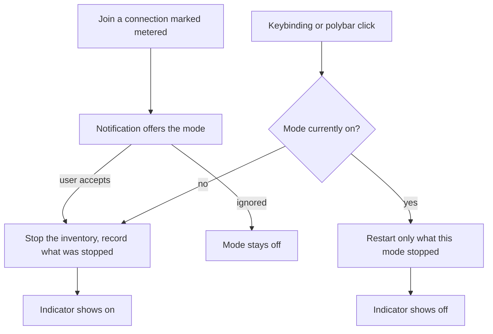

# Data Saving Mode - Plan

## Goal Capsule

- **Objective:** Give the laptop a data-saving mode in the same shape as Do Not Disturb — one toggle that stops the background work that spends data unattended, and leaves everything the user is actively driving alone.
- **Product authority:** This plan owns the mode itself: its toggle, its indicator, the inventory of what it stops, and the metered-connection prompt. It does not own connection management, firewalling, or data accounting.
- **Open blockers:** None.

---

## Product Contract

### Summary

A manual data-saving mode in the shape of the existing Do Not Disturb toggle: one keybinding and a polybar indicator that stop pCloud and the unattended background fetches, while anything the user is actively driving keeps full network access. Joining a connection marked metered offers to enable the mode; the mode never arms itself.

### Problem Frame

On a phone hotspot abroad, or on capped and throttled public wifi, the laptop keeps spending data on work nobody asked for. pCloud syncs continuously in the background. The polybar ETH module polls CoinGecko every 60 seconds and the calendar module every 30. The keyring sync timer fetches on its own schedule. None of this is visible at the moment it costs money, and none of it is work the user initiated.

The cost lands twice: as overage on a mobile plan that was bought for a specific trip, and as a throttled connection at the moment real work depends on it. The only remedy available today is remembering to stop pCloud by hand — which also means remembering *how*, since its FUSE mount cannot safely be killed outright and the safe teardown sequence is several steps long.

### Key Decisions

- **The mode is manual and never arms itself.** It changes what runs on the machine, so it asks rather than deciding. Governs R1, R10.
- **Only connections the user has explicitly marked metered trigger the prompt.** NetworkManager's guessed value is already wrong on the current wifi, so keying on the guess would prompt falsely every day. Governs R10.
- **The mode stops a named inventory rather than all egress.** Predictable, needs no root, and each consumer fails soft; the cost is that a consumer added later escapes until it is added. Governs R5, R6, R7, R8.
- **Stopping pCloud reuses the existing pre-suspend teardown path.** That path already runs on every lid close and handles the FUSE D-state trap that makes a plain kill unsafe. Governs R5.
- **The mode is session-scoped rather than persistent.** The sibling toggles in this repo keep state in `/tmp`, and the metered prompt re-offers the mode on reconnect after a reboot. Governs R4.
- **The toggle sits beside Do Not Disturb on the same key.** `$mod+z` is DND and `$mod+Shift+z` is this mode, so one key carries both machine-wide modes. Governs R1.

### Requirements

**Toggle and indicator**

- R1. A single command toggles the mode on and off, reachable from both `$mod+Shift+z` and a left-click on its polybar module, in the same shape as the Do Not Disturb toggle.
- R2. The polybar indicator shows whether the mode is on or off at all times, not only while it is on.
- R3. Turning the mode on or off confirms with a notification naming the new state.
- R4. The mode is session-scoped: after a reboot or logout the machine comes up with the mode off.

**What the mode stops**

- R5. Turning the mode on stops pCloud through the same teardown path used before suspend; turning it off starts it again.
- R6. While the mode is on, the polybar modules that make network calls skip their fetch and render their last cached value rather than blanking or erroring.
- R7. While the mode is on, the network-using system timer does not run.
- R8. While the mode is on, newsboat does not auto-reload its feeds; a reload the user asks for by hand still works.
- R9. The mode does not restrict any application the user is actively driving, including the browser, terminal, editors, and agent CLIs.

**Metered prompt**

- R10. Joining a connection the user has explicitly marked metered raises a notification offering to enable the mode, and the mode stays off until the user acts on that offer.

**Restoring**

- R11. Turning the mode off restores only what the mode itself stopped; anything the user had already stopped by hand before enabling the mode stays stopped.

### Key Flows

- F1. Toggle the mode by hand
  - **Trigger:** The user presses the keybinding or left-clicks the polybar module.
  - **Steps:** The mode flips state; on enable it stops each consumer in the inventory and records which ones it actually stopped; on disable it restarts only those. A notification names the new state and the indicator follows within its poll interval.
  - **Outcome:** Background data use stops or resumes; nothing the user is driving is disturbed.
  - **Covered by:** R1, R2, R3, R5, R6, R7, R8, R11

- F2. Arrive on a metered connection
  - **Trigger:** The machine connects to a connection the user has explicitly marked metered.
  - **Steps:** A notification offers to enable the mode. If the user accepts, F1's enable path runs. If the user ignores it, nothing changes.
  - **Outcome:** The user is reminded at the moment it matters, without the machine deciding for them.
  - **Covered by:** R10, and R1 for the enable path

### Acceptance Examples

- AE1. **Covers R10.** Given a wifi connection the user marked metered, when the machine joins it, then a notification offers the mode and the mode remains off until the user accepts.
- AE2. **Covers R10.** Given a wifi connection NetworkManager reports as metered by guess but the user never marked, when the machine joins it, then no notification appears.
- AE3. **Covers R11.** Given pCloud was already stopped by hand before the mode was enabled, when the mode is turned off, then pCloud stays stopped.
- AE4. **Covers R6.** Given the mode is on, when the ETH polybar module refreshes, then it shows its last known price rather than blanking, erroring, or disappearing from the bar.
- AE5. **Covers R4.** Given the mode is on, when the machine reboots, then it comes up with the mode off.
- AE6. **Covers R9.** Given the mode is on, when the user loads a page in the browser or runs an agent CLI, then neither is throttled, blocked, or otherwise altered.

### Scope Boundaries

- Throttling or blocking foreground applications — browser prefetch, autoplaying video, and similar — is out. The mode's line is unattended work versus work the user is driving.
- Firewall-, cgroup-, or slice-level egress enforcement is out. It would cover consumers nobody enumerated, at the cost of root, new network state, and silent failures.
- Making NetworkManager's metered flag itself the mode's state is out. It would auto-arm the mode and remove the prompt.
- Measuring or reporting how much data the mode saved is out. Useful, but a separate capability with its own accounting problem.
- Any change to how connections are chosen, ranked, or authenticated is out.

### Dependencies / Assumptions

- NetworkManager manages connections and exposes a per-connection metered property that the user can set explicitly. Verified on the machine: the active connection reports `GENERAL.METERED: yes (guessed)`, which is why R10 requires an explicit mark.
- `usr/local/bin/pcloud-teardown` is the safe way to stop pCloud and is already invoked before every suspend. The mode depends on that path continuing to exist.
- Polybar modules in this repo are poll-based; no script in the repo uses polybar IPC. The indicator therefore updates within its poll interval rather than instantly, which matches the Do Not Disturb indicator's behavior.
- The background-consumer inventory behind R5 through R8 is complete as of 2026-09-14: pCloud, the two network-calling polybar modules, the keyring sync timer, and newsboat's auto-reload. There is no pacman or paru auto-update timer on this machine. A consumer added later escapes the mode until it is added to the inventory.
- `eth_chart` also reaches the network but is launched by the user from the price module, so it counts as actively driven under R9 and is not in the inventory.

### Outstanding Questions

**Deferred to Planning**

- How each network-calling consumer learns the mode is on — a shared state file the pollers read, a wrapper around them, or per-consumer configuration.
- How the keyring sync timer is suppressed and restored, given it is a `static` unit rather than an enabled one.
- Whether newsboat's auto-reload is suppressed by configuration or by the mode refusing the reload, given newsboat runs only while its dropdown is open.

### Sources / Research

- `home/.config/i3/scripts/dnd-toggle` and `home/.config/i3/scripts/dnd-status` — the toggle and indicator pattern this mode mirrors, including how state is read from the owning subsystem rather than duplicated.
- `home/.config/polybar/config.ini` — module conventions: `type = custom/script` with an `interval`, `click-left` for actions, and no IPC anywhere in the repo.
- `usr/local/bin/pcloud-teardown` — the safe stop sequence and its notes on the FUSE D-state trap that makes SIGKILL insufficient.
- `etc/systemd/system/pcloud-suspend.service` and `etc/systemd/system/pcloud-resume.service` — the existing stop and restart precedent around suspend.
- `docs/solutions/power-management/pcloud-restart-policy-rejected.md` — why pCloud carries no systemd restart policy, which constrains how the mode restarts it.
- `home/.config/i3/scripts/eth_price` and `home/.config/i3/scripts/gcal-next` — the two polling network consumers and their intervals.
- `home/.config/newsboat/config` — the `auto-reload` and `reload-time` settings behind R8.
