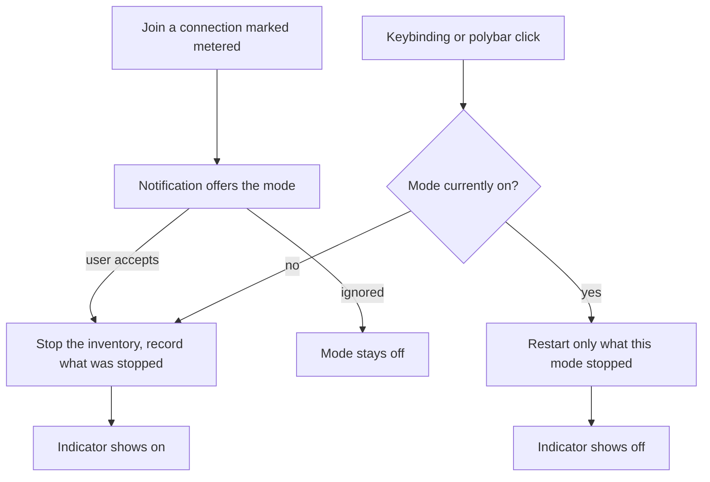
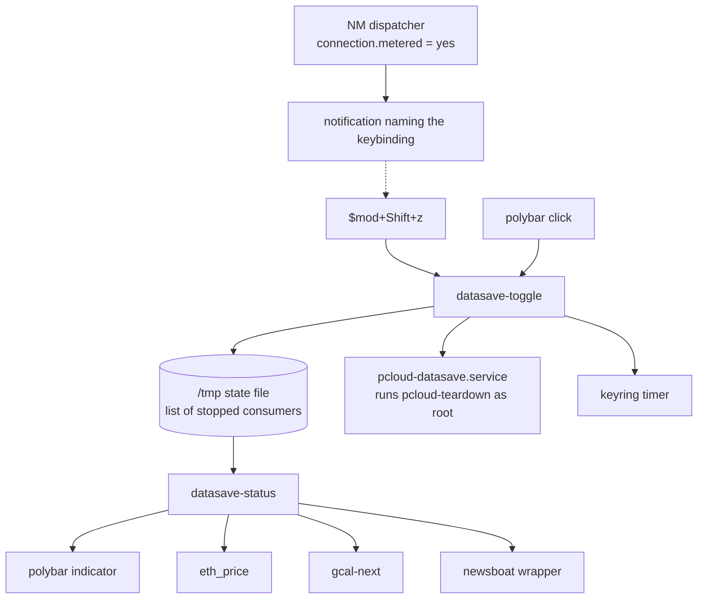

# Data Saving Mode - Plan

## Goal Capsule

- **Objective:** Give the laptop a data-saving mode in the same shape as Do Not Disturb — one toggle that stops the background work that spends data unattended, and leaves everything the user is actively driving alone.
- **Product authority:** This plan owns the mode itself: its toggle, its indicator, the inventory of what it stops, and the metered-connection prompt. It does not own connection management, firewalling, or data accounting.
- **Plan key:** `datasave`. Cite units as `datasave/U3`, never a bare `U3` — a bare unit id names nothing once a second plan is live.
- **Open blockers:** None.
- **Product Contract preservation:** changed: R6 — added a day-boundary qualifier. The calendar module's cache is keyed to today, so serving it unchanged past midnight would present yesterday's schedule as today's. No other requirement changed; all R-IDs are stable.

---

## Product Contract

### Summary

A manual data-saving mode in the shape of the existing Do Not Disturb toggle: one keybinding and a polybar indicator that stop pCloud and the unattended background fetches, while anything the user is actively driving keeps full network access. Joining a connection marked metered offers to enable the mode; the mode never arms itself.

### Problem Frame

On a phone hotspot abroad, or on capped and throttled public wifi, the laptop keeps spending data on work nobody asked for. pCloud syncs continuously in the background. The polybar ETH module polls CoinGecko every 60 seconds and the calendar module every 30. The keyring sync timer fetches on its own schedule. None of this is visible at the moment it costs money, and none of it is work the user initiated.

The cost lands twice: as overage on a mobile plan that was bought for a specific trip, and as a throttled connection at the moment real work depends on it. The only remedy available today is remembering to stop pCloud by hand — which also means remembering *how*, since its FUSE mount cannot safely be killed outright and the safe teardown sequence is several steps long.

### Key Decisions

- **The mode is manual and never arms itself.** It changes what runs on the machine, so it asks rather than deciding. (session-settled: user-directed — chosen over arming itself on a metered connection: the mode changes what runs, so it asks.) Governs R1, R10.
- **Only connections the user has explicitly marked metered trigger the prompt.** NetworkManager's guessed value is already wrong on the current wifi, so keying on the guess would prompt falsely every day. (session-settled: user-directed — chosen over keying on NetworkManager's guessed metered value: the guess is wrong on the current wifi.) Governs R10.
- **The mode stops a named inventory rather than all egress.** Predictable, and each consumer fails soft; the cost is that a consumer added later escapes until it is added. (session-settled: user-directed — chosen over cgroup plus nftables egress blocking: predictable and soft-failing, at the cost of missing consumers added later.) Governs R5, R6, R7, R8.
- **Stopping pCloud reuses the existing pre-suspend teardown path.** That path already runs on every lid close and handles the FUSE D-state trap that makes a plain kill unsafe. (session-settled: user-approved — chosen over a bespoke stop sequence: the existing path is already proven on every suspend.) Governs R5.
- **The mode is session-scoped rather than persistent.** The sibling toggles in this repo keep state in `/tmp`, and the metered prompt re-offers the mode on reconnect after a reboot. (session-settled: user-approved — chosen over state that survives reboot: sibling toggles behave the same way and the prompt re-offers on reconnect.) Governs R4.
- **The toggle sits beside Do Not Disturb on the same key.** `$mod+z` is DND and `$mod+Shift+z` is this mode, so one key carries both machine-wide modes. (session-settled: user-directed — chosen over `$mod+m` and `$mod+Shift+m`: pairing both machine-wide modes on one key.) Governs R1.

### Requirements

**Toggle and indicator**

- R1. A single command toggles the mode on and off, reachable from both `$mod+Shift+z` and a left-click on its polybar module, in the same shape as the Do Not Disturb toggle.
- R2. The polybar indicator shows whether the mode is on or off at all times, not only while it is on.
- R3. Turning the mode on or off confirms with a notification naming the new state.
- R4. The mode is session-scoped: after a reboot or logout the machine comes up with the mode off.

**What the mode stops**

- R5. Turning the mode on stops pCloud through the same teardown path used before suspend; turning it off starts it again.
- R6. While the mode is on, the polybar modules that make network calls skip their fetch and render their last cached value rather than blanking or erroring; a cached value no longer valid for today renders a neutral paused marker instead of stale content presented as current.
- R7. While the mode is on, the network-using system timer does not run.
- R8. While the mode is on, newsboat does not auto-reload its feeds; a reload the user asks for by hand still works.
- R9. The mode does not restrict any application the user is actively driving, including the browser, terminal, editors, and agent CLIs.

**Metered prompt**

- R10. Joining a connection the user has explicitly marked metered raises a notification offering to enable the mode, and the mode stays off until the user acts on that offer.

**Restoring**

- R11. Turning the mode off restores only what the mode itself stopped; anything the user had already stopped by hand before enabling the mode stays stopped.

### Key Flows

- F1. Toggle the mode by hand
  - **Trigger:** The user presses the keybinding or left-clicks the polybar module.
  - **Steps:** The mode flips state; on enable it stops each consumer in the inventory and records which ones it actually stopped; on disable it restarts only those. A notification names the new state and the indicator follows within its poll interval.
  - **Outcome:** Background data use stops or resumes; nothing the user is driving is disturbed.
  - **Covered by:** R1, R2, R3, R5, R6, R7, R8, R11

- F2. Arrive on a metered connection
  - **Trigger:** The machine connects to a connection the user has explicitly marked metered.
  - **Steps:** A notification offers to enable the mode. If the user accepts, F1's enable path runs. If the user ignores it, nothing changes.
  - **Outcome:** The user is reminded at the moment it matters, without the machine deciding for them.
  - **Covered by:** R10, and R1 for the enable path

### Acceptance Examples

- AE1. **Covers R10.** Given a wifi connection the user marked metered, when the machine joins it, then a notification offers the mode and the mode remains off until the user accepts.
- AE2. **Covers R10.** Given a wifi connection NetworkManager reports as metered by guess but the user never marked, when the machine joins it, then no notification appears.
- AE3. **Covers R11.** Given pCloud was already stopped by hand before the mode was enabled, when the mode is turned off, then pCloud stays stopped.
- AE4. **Covers R6.** Given the mode is on, when the ETH polybar module refreshes, then it shows its last known price rather than blanking, erroring, or disappearing from the bar.
- AE5. **Covers R4.** Given the mode is on, when the machine reboots, then it comes up with the mode off.
- AE7. **Covers R4, R7.** Given the mode is on, when the user logs out and back in, then the mode reads off and the keyring timer is running again.
- AE6. **Covers R9.** Given the mode is on, when the user loads a page in the browser or runs an agent CLI, then neither is throttled, blocked, or otherwise altered.

### Scope Boundaries

- Throttling or blocking foreground applications — browser prefetch, autoplaying video, and similar — is out. The mode's line is unattended work versus work the user is driving.
- Firewall-, cgroup-, or slice-level egress enforcement is out. It would cover consumers nobody enumerated, at the cost of root, new network state, and silent failures.
- Making NetworkManager's metered flag itself the mode's state is out. It would auto-arm the mode and remove the prompt.
- Measuring or reporting how much data the mode saved is out. Useful, but a separate capability with its own accounting problem.
- Any change to how connections are chosen, ranked, or authenticated is out.

### Dependencies / Assumptions

- NetworkManager manages connections and exposes a per-connection metered property that the user can set explicitly. Verified on the machine: the active connection reports `GENERAL.METERED: yes (guessed)`, which is why R10 requires an explicit mark.
- `usr/local/bin/pcloud-teardown` is the safe way to stop pCloud and is already invoked before every suspend. The mode depends on that path continuing to exist.
- Polybar modules in this repo are poll-based; no script in the repo uses polybar IPC. The indicator therefore updates within its poll interval rather than instantly, which matches the Do Not Disturb indicator's behavior.
- The background-consumer inventory behind R5 through R8 is complete as of 2026-09-14: pCloud, the two network-calling polybar modules, the keyring sync timer, and newsboat's auto-reload. There is no pacman or paru auto-update timer on this machine. A consumer added later escapes the mode until it is added to the inventory.
- `eth_chart` also reaches the network but is launched by the user from the price module, so it counts as actively driven under R9 and is not in the inventory.

### Outstanding Questions

**Deferred to Implementation**

- Whether the metered offer needs rate limiting. NetworkManager re-emits `up` on every reconnect and roaming event on the same profile, so a flapping access point produces repeated notifications. One per event is specified; nothing is specified per flap.
- Whether the enable path should reconcile stale state — refusing to trust a recorded `pcloud` entry while a pCloud process is running, say — so a half-written state file cannot produce a duplicate instance.

### Sources / Research

- `home/.config/i3/scripts/dnd-toggle` and `home/.config/i3/scripts/dnd-status` — the toggle and indicator pattern this mode mirrors, including how state is read from the owning subsystem rather than duplicated.
- `home/.config/polybar/config.ini` — module conventions: `type = custom/script` with an `interval`, `click-left` for actions, and no IPC anywhere in the repo.
- `usr/local/bin/pcloud-teardown` — the safe stop sequence and its notes on the FUSE D-state trap that makes SIGKILL insufficient.
- `etc/systemd/system/pcloud-suspend.service` and `etc/systemd/system/pcloud-resume.service` — the existing stop and restart precedent around suspend.
- `docs/solutions/power-management/pcloud-restart-policy-rejected.md` — why pCloud carries no systemd restart policy, which constrains how the mode restarts it.
- `home/.config/i3/scripts/eth_price` and `home/.config/i3/scripts/gcal-next` — the two polling network consumers and their intervals.
- `home/.config/newsboat/config` — the `auto-reload` and `reload-time` settings behind R8; `home/.config/i3/config:221-223` for how newsboat is actually launched and toggled.
- `etc/systemd/system/pcloud-sleep-failed@.service` — the repo's existing pattern for delivering a notification from a root context into the desktop session.
- `home/.config/dunst/dunstrc:142` — `markup = full`, which is why notification text is fixed rather than interpolated.

---

## Planning Contract

### Key Technical Decisions

- KTD1. **Stop pCloud by starting a system unit that runs the existing teardown, not by calling the teardown directly.** `usr/local/bin/pcloud-teardown:18` guards its FUSE abort with `[ -w /sys/fs/fuse/connections/$1/abort ]`, so a user-run teardown silently skips the abort and the lazy unmount and degrades to SIGTERM/SIGKILL — unable to release the D-state wedge the script exists to handle. A oneshot system unit runs the identical script with the privileges it was written for. Governs R5.
- KTD2. **Restore pCloud with `systemctl --user restart pcloud.service`, never by re-execing the binary.** Mirrors `etc/systemd/system/pcloud-resume.service:30`; a bare relaunch creates an instance outside systemd's cgroup. `restart` also starts the unit from `failed`, which the teardown's SIGKILL fallback can produce now that `SuccessExitStatus` lists only SIGTERM. Governs R5, R11.
- KTD3. **The state file records which consumers were actually stopped, not merely that the mode is on.** Restoring only what this mode stopped needs per-consumer facts, not a boolean. Follows `home/.config/i3/scripts/ws-toggle-icons`, which keeps saved data in its `/tmp` state file and removes the file on restore. Governs R4, R11.
- KTD4. **One owner for "is the mode on": every consumer asks `datasave-status`, none re-reads the state file.** Keeps the state format private to one script, so the consumers do not drift as it changes. Governs R6, R7, R8.
- KTD5. **The metered offer is a notification that names the keybinding, not a clickable action.** `home/.config/dunst/dunstrc:277` sets `mouse_left_click = close_current` and no `dunstctl` keybinding exists in `home/.config/i3/config`, so a `notify-send --action` button would be nearly unreachable. Naming the binding makes the offer actionable with what is already bound. Governs R10.
- KTD6. **The dispatcher script is tracked but not restorable, like the existing pCloud system units.** `restore.sh` has no path that replays anything under `etc/`; `sync.sh:94` states the directory is backup-only. Building the first `etc/` restore path is a larger change than this feature warrants. Governs R10.
- KTD7. **`eth_price` gains a cache; `gcal-next`'s existing refresh gate is reused.** `eth_price` curls fresh on every poll with nothing on disk, so serving a last value requires introducing one. `gcal-next` already caches with a staleness/force protocol, so the mode only has to suppress its refresh decision. Governs R6.
- KTD9. **A narrow polkit rule is shipped as a repo file the user installs, not applied automatically.** Managing the two system units needs authentication, so the mode ships a rule scoped to one user and exactly two units. It lands under `etc/`, which is backup-only, so it takes effect only when the user installs it with their own `sudo` — no privilege is granted as a side effect of this feature. Until then the toggle skips those two consumers and records them as not stopped. Governs R5, R7.
- KTD8. **Every consumer is stopped independently and fails soft.** A consumer that cannot be stopped is recorded as not-stopped, so the restore path never starts something this mode did not stop, and one failure does not abort the rest. Governs R9, R11.

### High-Level Technical Design

The toggle is the only writer of state. `datasave-status` is the only reader, and every consumer asks it rather than reading the file, so the format stays private to those two scripts.

### Assumptions

- **Managing system units requires authentication, so the mode ships a policy rule.** Verified 2026-09-14: `org.freedesktop.systemd1.manage-units` has `allow_active = auth_admin_keep`, and `pkcheck` reports `polkit.retains_authorization_after_challenge=1` — an earlier stop/start that appeared to succeed unprompted did so on a cached authorization, not on an unprivileged action. A polkit authentication agent runs from `home/.config/i3/config:298`, so an ordinary `systemctl` call would raise a modal password dialog. Both R5 (via KTD1's unit) and R7 depend on this, and both are handled by KTD9.
- **The toggle never blocks on an authentication prompt.** Every system-unit call passes `--no-ask-password`, which fails cleanly — verified 2026-09-14: `Access denied ... interactive authentication has not been enabled by the calling program`, exit without a prompt and with the unit untouched. That is what makes KTD8's fail-soft rule hold for these two consumers.
- Polybar has no IPC anywhere in this repo, so the indicator updates on its own poll tick rather than instantly — the same behavior the Do Not Disturb indicator already has.
- `sync.sh:28` and `restore.sh:200` copy `~/.config/i3/scripts/*` wholesale in both directions, so new scripts there need no sync wiring.
- There is no CI and no test runner; tests are shell scripts invoked by hand. `shellcheck` is not installed on this machine.

### Sequencing

U1 and U2 establish the state contract and must land first. U4 depends only on U1 and can start as soon as U1 lands; U3 and U5 depend on U2 as well, since both modify `datasave-toggle`, which U2 creates. U6 makes the feature reachable and should land once U2 works. U7 is independent of the consumers and can land any time after U2. U8 closes the feature.

---

## Implementation Units

### U1. State contract and status script

- **Goal:** A `datasave-status` script that owns the state file format and renders the polybar indicator.
- **Requirements:** R2, R4; the state contract behind R11
- **Dependencies:** none
- **Files:** `home/.config/i3/scripts/datasave-status`, `tests/datasave-mode.sh`
- **Approach:**
  1. Mirror `home/.config/i3/scripts/dnd-status` structure exactly: header comment naming its callers, env-overridable glyph variables with the nerd-font name in a comment, a pure `render` function that takes state and prints, a `print_status` that reads state and calls `render`, a `main` dispatch defaulting to `status` with `usage: ... exit 2` on an unknown argument, and the `if [ "${BASH_SOURCE[0]}" = "${0}" ]` guard so tests can source it.
  2. Subcommands: `status` (default, prints the indicator), `is-on` (exit 0 when the mode is on, non-zero otherwise — the seam every consumer uses per KTD4), `stopped <name>` (exit 0 when that consumer is recorded as stopped), `record <name>` / `clear` for the toggle's writes.
  3. State lives at `${DATASAVE_STATE:-${XDG_RUNTIME_DIR:-/tmp}/datasave-state}`: file presence means the mode is on, and each line names a consumer this mode actually stopped. The runtime directory is what makes R4's logout clause true — logind removes it at logout, while `/tmp` survives until reboot. The environment override exists so the test suite never touches live mode state, matching the `RESTORE_SCRIPT` convention in `tests/session-layout-roundtrip.sh:12`.
  4. `tests/datasave-mode.sh` is created here and extended by each later unit; U8 consolidates it rather than starting it.
- **Patterns to follow:** `home/.config/i3/scripts/dnd-status` for structure; `home/.config/i3/scripts/ws-toggle-icons` for the state file.
- **Test scenarios:**
  - `render` with the mode on prints the on glyph; with it off prints the off glyph. Covers R2.
  - `is-on` exits non-zero when the state file is absent, zero when present.
  - `stopped pcloud` exits zero only when `pcloud` is a line in the state file.
  - An unknown subcommand prints usage to stderr and exits 2.
  - Sourcing the script runs no side effects and creates no state file.
- **Verification:** `bash tests/datasave-mode.sh` passes; running the script by hand with and without the state file prints the two indicator states.

### U2. The toggle

- **Goal:** `datasave-toggle` flips the mode, stopping and restoring consumers and notifying.
- **Requirements:** R1, R3, R9, R11
- **Dependencies:** U1
- **Files:** `home/.config/i3/scripts/datasave-toggle`
- **Approach:**
  1. On enable: create the state file, then attempt each consumer in turn, recording only those actually stopped (KTD3, KTD8). On disable: restore only recorded consumers, then remove the state file.
  2. Each consumer is a small function returning success only when it actually stopped the thing, so a failure records nothing and the restore path stays honest.
  3. Notify on both transitions with `notify-send -u low`, matching `dnd-toggle`'s urgency and message shape. When some consumers failed, say so in the message rather than claiming a clean toggle.
  4. Carry the same `main` dispatch and `if [ "${BASH_SOURCE[0]}" = "${0}" ]` guard as `datasave-status`, and reach systemd and nmcli through overridable `SYSTEMCTL` and `NMCLI` variables, so the suite can source the script and stub both without touching real services.
  5. Every system-unit call passes `--no-ask-password` so an unauthorized call fails cleanly instead of raising a password dialog.
- **Execution note:** Write the enable/disable state transitions test-first against a stubbed consumer list — the ordering and the record-only-what-stopped rule are the parts that break silently.
- **Patterns to follow:** `home/.config/i3/scripts/dnd-toggle` for shape and notification style.
- **Test scenarios:**
  - Enabling when off creates the state file; disabling when on removes it. Covers R1.
  - A consumer whose stop fails is not recorded, and disabling does not try to restore it. Covers R11, AE3.
  - A consumer the user had already stopped is not recorded as stopped by this mode. Covers R11, AE3.
  - Both transitions emit a notification naming the new state. Covers R3.
  - A partial failure still completes the remaining consumers. Covers R9.
- **Verification:** `bash tests/datasave-mode.sh` passes; toggling by hand flips the polybar indicator within its poll interval.

### U3. pCloud stop and restore

- **Goal:** The mode stops pCloud through the real teardown and brings it back.
- **Requirements:** R5, R9, R11
- **Dependencies:** U2
- **Files:** `etc/systemd/system/pcloud-datasave.service`, `etc/polkit-1/rules.d/49-datasave-units.rules`, `home/.config/i3/scripts/datasave-toggle`, `sync.sh`
- **Approach:**
  1. A oneshot system unit whose `ExecStart` is `/usr/local/bin/pcloud-teardown` (KTD1). Model its header comments on `etc/systemd/system/pcloud-suspend.service`, which runs the same script. Give it no `[Install]` section and say in the header that it is manual-start-only, so copying that unit's sleep-target wiring cannot make it fire on every suspend as well.
  2. Decide whether pCloud is running with `pgrep -x pcloud.bin || pgrep -x pCloud.AppImage` — the pair `usr/local/bin/pcloud-teardown:41` itself targets — never `systemctl --user is-active pcloud.service`: the unit has no `[Install]` and at login pCloud is started by `dex --autostart`, so the unit reports inactive while pCloud runs.
  3. Start the unit only when that check says pCloud is running. The teardown's no-mount branch reaches for other FUSE connections, and `usr/local/bin/pcloud-teardown:52-71` records that a wrong abort returns EIO on that connection silently for the rest of the session — so firing it with nothing to tear down is the one path where it can do harm without doing work.
  4. Restore with `systemctl --user restart pcloud.service` (KTD2). Record `pcloud` only when it was running beforehand and is not running afterward.
  5. Ship `etc/polkit-1/rules.d/49-datasave-units.rules` (KTD9): a `polkit.addRule` returning `polkit.Result.YES` for `org.freedesktop.systemd1.manage-units` when the subject is the desktop user and `action.lookup("unit")` is exactly `pcloud-datasave.service` or `archlinux-keyring-wkd-sync.timer`. Add it and the new unit to `sync.sh`'s explicit `etc/` backup loop, and add their parent directories to the `mkdir -p` that precedes it, or the copy aborts the run under `set -euo pipefail`.
  6. Do not add `Restart=` to `pcloud.service` — see `docs/solutions/power-management/pcloud-restart-policy-rejected.md`.
- **Patterns to follow:** `etc/systemd/system/pcloud-suspend.service` for the unit; `etc/systemd/system/pcloud-resume.service:30` for the restore call.
- **Test scenarios:**
  - With pCloud already stopped, enabling does not record `pcloud` and disabling leaves it stopped. Covers AE3.
  - With pCloud running, enabling records it and leaves no `pcloud.bin` process.
  - Disabling after enabling leaves exactly one pCloud instance, owned by the user unit rather than a stray process.
  - A unit start that fails records nothing and does not abort the other consumers. Covers R9.
- **Verification:** With pCloud running, enable the mode and confirm no `pcloud.bin` or `pCloud.AppImage` process remains and `~/pCloudDrive` is released; disable and confirm exactly one process returns. Without the polkit rule installed, confirm the toggle reports pCloud as not stopped instead of raising a password dialog.

### U4. Polybar consumers honor the mode

- **Goal:** The two network-calling modules stop fetching while the mode is on.
- **Requirements:** R6
- **Dependencies:** U1
- **Files:** `home/.config/i3/scripts/eth_price`, `home/.config/i3/scripts/gcal-next`
- **Approach:**
  1. `eth_price` has no cache: write the formatted value to a `/tmp` cache on every successful fetch, and when `datasave-status is-on` succeeds, print that cache instead of fetching. With no cache yet, print the existing failure placeholder.
  2. `gcal-next` already caches: force its `refresh` decision to zero while the mode is on, including the day-change branch that would otherwise clear the alert directory and refetch.
  3. Per R6's day-boundary qualifier, when the mode is on and the calendar cache is from a previous day, render the neutral placeholder rather than yesterday's events.
  4. Define that placeholder concretely and print it rather than exiting silently: `gcal-next:88` currently does `[[ ! -f "$CACHE_FILE" ]] && exit 0`, and a `custom/script` module with empty output disappears from the bar — the case R6 forbids. It applies both when the mode is on with no cache and when the cache is not from today.
- **Patterns to follow:** `gcal-next`'s existing `refresh_cache` gate and `CACHE_FILE` handling.
- **Test scenarios:**
  - With the mode on and a cache present, neither script makes a network call. Covers R6, AE4.
  - With the mode on and no cache, each renders its placeholder rather than blanking or erroring. Covers R6.
  - With the mode on and a calendar cache from a previous day, the neutral marker renders instead of the stale events. Covers R6.
  - With the mode off, both fetch exactly as before.
- **Verification:** With the mode on, both modules keep rendering and no request reaches the network; with it off, values refresh.

### U5. Keyring timer and newsboat auto-reload

- **Goal:** The remaining unattended consumers stop while the mode is on.
- **Requirements:** R7, R8, R11
- **Dependencies:** U2
- **Files:** `home/.config/i3/scripts/datasave-toggle`, `home/.config/i3/config`
- **Approach:**
  1. Stop `archlinux-keyring-wkd-sync.timer` on enable and start it on disable, recording it only when the stop succeeded. It is a `static` unit, so this is a stop/start of the timer, never an enable or disable.
  2. newsboat is **not** launched per dropdown open: `home/.config/i3/config:221` starts it once at login and parks it in the scratchpad, and `dropdown-toggle` only re-spawns it when the window is gone. So suppress it from both directions:
     - On enable, quit the running newsboat only when its window is hidden in the scratchpad — a visible one is being driven and R9 protects it — and record `newsboat` only when it was actually quit. On disable, relaunch it the way login does so it returns to the scratchpad.
     - Have the dropdown binding pass an override config while the mode is on, so an open during the mode starts without auto-reload. newsboat has no per-setting flag, only `-C`, so the override is a small file that `include`s the main config and sets `auto-reload no`.
- **Patterns to follow:** `home/.config/i3/config:221-223` for how newsboat is launched and toggled; `home/.config/i3/scripts/dropdown-toggle` for the show-or-respawn logic.
- **Test scenarios:**
  - Enabling stops the timer and records it; disabling starts it again. Covers R7.
  - A timer stop that fails records nothing and disabling does not start it. Covers R11.
  - With the mode on and newsboat hidden, it is quit and recorded; disabling brings it back into the scratchpad. Covers R8.
  - With the mode on and newsboat visible on screen, it is left running and not recorded. Covers R9.
  - Opening the dropdown while the mode is on starts newsboat without auto-reload; a reload asked for by hand still fetches. Covers R8.
  - With the mode off, newsboat launches with its configured auto-reload.
- **Verification:** `systemctl is-active archlinux-keyring-wkd-sync.timer` reports inactive with the mode on and active with it off; newsboat's auto-reload state matches the mode at launch.

### U6. Desktop wiring

- **Goal:** The toggle is reachable from the keyboard and the bar, and the indicator is visible.
- **Requirements:** R1, R2
- **Dependencies:** U2
- **Files:** `home/.config/i3/config`, `home/.config/polybar/config.ini`
- **Approach:**
  1. Add `bindsym $mod+Shift+z exec --no-startup-id ~/.config/i3/scripts/datasave-toggle` with a one-line comment above it, beside the Do Not Disturb binding at `home/.config/i3/config:267-268`.
  2. Add a `[module/datasave]` block modeled on `[module/dnd]` at `home/.config/polybar/config.ini:192-200` — `type = custom/script`, the status script as `exec`, `click-left` running the toggle, and `${colors.*}` tokens rather than literal hex so it follows the generated theme.
  3. Insert `datasave` into `modules-left` immediately after `dnd`.
  4. Add an `exec --no-startup-id` line that reconciles at login: unconditionally start `archlinux-keyring-wkd-sync.timer` and clear any stale state file. The state file cannot be relied on here — logind removes the runtime directory at logout, so a mode left on across logout loses its record while the timer stays stopped, and nothing else would ever restore it. Starting an already-running timer is a no-op, which makes the sweep safe to run every login.
- **Test scenarios:**
  - The login reconciliation starts the keyring timer when it was left stopped, and is a no-op when it is already running. Covers R7.
  - The login reconciliation removes a stale state file so the indicator reads off. Covers R4.
  - The `datasave` module name appears in `modules-left`, not only as a `[module/datasave]` block — a block that is never listed renders nowhere while passing every other gate.
- **Verification:** After reloading i3 and polybar, the indicator appears next to the Do Not Disturb one, the keybinding toggles it, and a left click does the same.

### U7. Metered-connection offer

- **Goal:** Joining a connection marked metered offers the mode without enabling it.
- **Requirements:** R10
- **Dependencies:** U2
- **Files:** `etc/NetworkManager/dispatcher.d/90-datasave-metered`, `sync.sh`
- **Approach:**
  1. A dispatcher script that acts only on the `up` action and looks the profile up by **UUID**: `nmcli -g connection.metered connection show uuid "$CONNECTION_UUID"`, checked for exactly `yes` — the per-connection setting the user marks, never the device-level guess, which reads `yes (guessed)` on ordinary wifi here.
  2. Treat `CONNECTION_ID` as untrusted input. A hostile access point chooses its own SSID and NetworkManager turns that into the profile name, so the name is attacker-controlled: a name beginning with `-` parses as an nmcli option, and profile names are not unique, so a colliding name would answer for the wrong profile. `CONNECTION_UUID` is machine-generated and unique, which removes the class rather than quoting around it. `CONNECTION_ID` is never passed to a shell, never used as a bare positional argument, and never placed in notification text.
  3. The notification's title and body are fixed strings naming the keybinding (KTD5), with nothing interpolated from the connection. `home/.config/dunst/dunstrc:142` sets `markup = full`, so an interpolated SSID could put spoofed markup into a popup that carries the authority of a root-originated system message.
  4. Deliver it by dropping privilege first, the way this repo already does: `systemd-run --user --machine=matteo@.host --collect --quiet /usr/bin/notify-send ...`, as in `etc/systemd/system/pcloud-sleep-failed@.service:13`. The dispatcher environment carries no `DBUS_SESSION_BUS_ADDRESS`, `DISPLAY`, or `XDG_RUNTIME_DIR`, so a bare root `notify-send` exits non-zero and shows nothing while the script still returns 0. The call must tolerate failing when no session is running — a connection can come up at the greeter.
  5. It never enables the mode itself.
  3. Dispatcher scripts run as root and must be root-owned, executable, and not group- or world-writable or NetworkManager skips them silently — verify it actually ran rather than assuming.
  6. Extend `sync.sh`'s explicit `etc/` backup loop to include the new path, and add `etc/NetworkManager/dispatcher.d` to the `mkdir -p` that precedes it. Per KTD6 it is backup-only; `restore.sh` is unchanged.
- **Test scenarios:**
  - A connection whose `connection.metered` is `yes` produces exactly one notification. Covers R10, AE1.
  - A connection reported metered only as a guess produces none. Covers R10, AE2.
  - A profile whose name begins with `-` or collides with another profile's name is still resolved correctly, because the lookup is by UUID.
  - The notification text is identical regardless of the connection's name.
  - A dispatcher action other than `up` produces none.
  - The notification does not change the mode's state. Covers R10.
- **Verification:** Mark a test connection metered, reconnect, and confirm the notification appears and the mode stays off; confirm nothing appears on the current wifi, which NetworkManager only guesses is metered.

### U8. Tests and documentation

- **Goal:** The feature is covered by the repo's harness and documented like its siblings.
- **Requirements:** all
- **Dependencies:** U1 through U7
- **Files:** `tests/datasave-mode.sh`, `tests/session-layout-roundtrip.sh`, `docs/datasave-mode.md`
- **Approach:**
  1. Consolidate the assertions each unit added to `tests/datasave-mode.sh` since U1 and finish the harness: `fail`/`pass` helpers and a `FAILED` counter, an env-overridable script path defaulting to the repo copy, and sourcing the scripts to reach their functions behind the `BASH_SOURCE` guard. Point `DATASAVE_STATE` at a temporary path so the suite never touches live mode state.
  2. Extend the tracked-versus-installed drift check to the new scripts, so a live edit that was never synced fails the suite.
  3. `docs/datasave-mode.md` covers what the mode stops, how to mark a connection metered with `nmcli connection modify <name> connection.metered yes`, and that the dispatcher script, the system unit and the polkit rule all live under `etc/`, which is backup-only — they must be installed by hand with `sudo` on a fresh machine, and until the polkit rule is installed the mode skips pCloud and the keyring timer.
  4. The same document records that the mode suppresses a security control, not only a data cost: while it is on, Arch packager keys are not refreshed and pCloud backups are not current, so leaving it on indefinitely has a cost beyond stale widgets.
- **Test scenarios:** the suite itself; each assertion is listed under U1 through U7.
- **Verification:** `bash tests/datasave-mode.sh` and `bash tests/session-layout-roundtrip.sh` both pass; breaking one consumer's stop makes the suite fail.

---

## Verification Contract

| Gate | Command | Applies to |
|---|---|---|
| Automated tests | `bash tests/datasave-mode.sh` | U1, U2, U4, U6, and the stubbed consumer logic of U3, U5, U7 |
| Existing suite unaffected | `bash tests/session-layout-roundtrip.sh` | U8 |
| Shell syntax | `bash -n` on every created or modified script | U1–U8 |
| Tracked copies match installed | the drift assertions in both suites | U8 |
| Manual, live services | the per-unit Verification bullets | U3, U5, U7 |

The automated suite stubs `SYSTEMCTL` and `NMCLI` and points `DATASAVE_STATE` at a temporary file, so it never starts or stops a real service. The scenarios needing a live pCloud with a FUSE mount, an authenticated system-unit start, or a real NetworkManager `up` event cannot run from a sourcing-based shell harness and are verified by hand — a separate gate rather than a claim the suite cannot honor.

`shellcheck` is not installed on this machine, so it is not a gate.

## Definition of Done

- Every requirement R1 through R11 is either implemented or explicitly recorded as deferred with a reason.
- Both test suites pass, and the new suite fails when a consumer's stop is broken (verified against the stubbed consumers, not live services).
- The scripts are installed to the live machine as well as committed, so the tracked and installed copies match and the feature actually runs.
- With the polkit rule installed, toggling by hand stops pCloud, the two polybar fetches, the keyring timer, and newsboat, and toggling back restores exactly what was stopped.
- Without the polkit rule installed, the toggle still stops the polybar fetches and newsboat, reports pCloud and the timer as not stopped, and never raises a password dialog.
- The polybar indicator shows both states and the keybinding and left-click both work.
- A connection marked metered produces the offer; the current wifi, metered only by guess, produces none.
