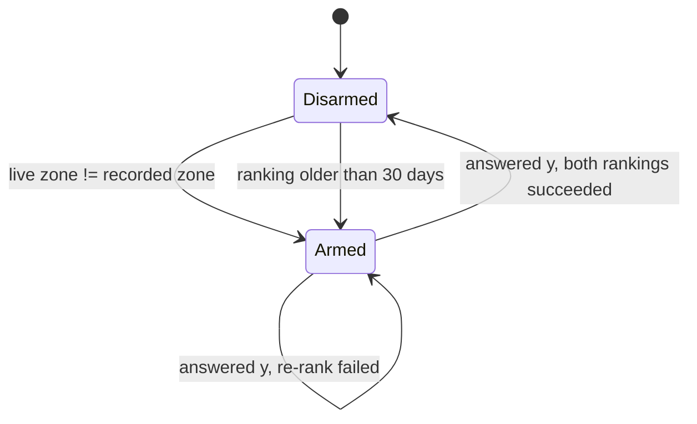
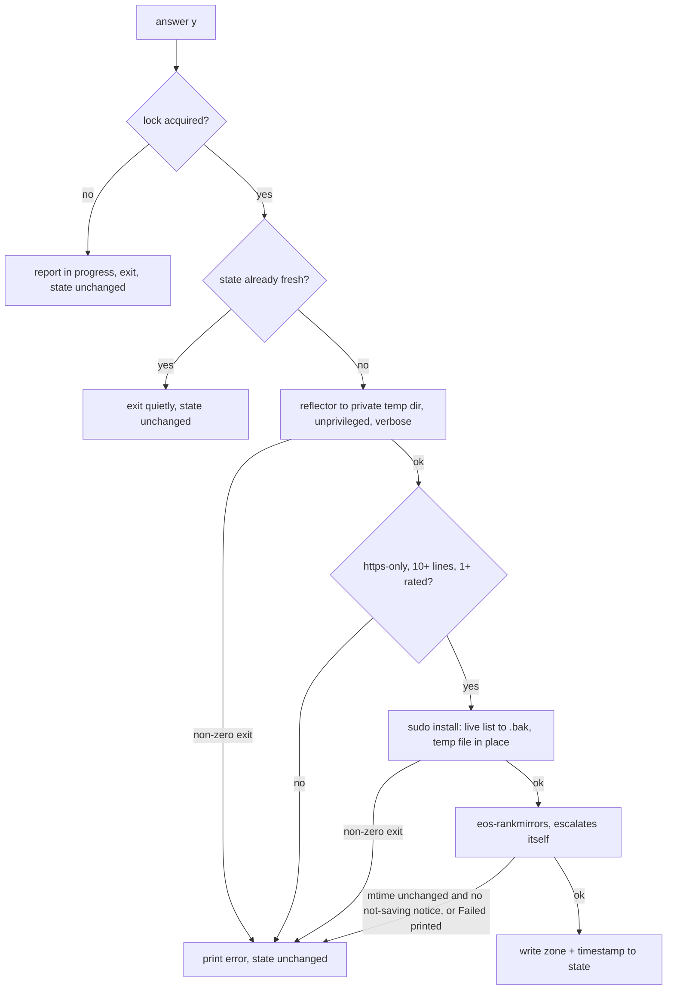

# Mirror Re-rank Prompt - Plan

## Goal Capsule

- **Objective:** Make a stale or wrong-continent mirrorlist impossible to forget, by arming a standing flag when the timezone changes or the ranking ages out and asking at every new interactive shell until the re-rank actually succeeds.
- **Product authority:** This plan owns the arming conditions, the shell prompt and its persistence, and the re-rank command that runs on acceptance. It does not own the metered-connection mode, the weekly `system_settings` sync check, or any change to how `paru` upgrades run.
- **Plan key:** `mirrors`. Cite units as `mirrors/U3` in commit subjects and anywhere outside this document; bare `U1`-`U4` are unambiguous within it.
- **Stop conditions:** Stop and ask if the work would touch `/etc/pacman.d/` outside the two mirrorlist files and their `.bak` siblings, change how `paru` runs, or enable any systemd timer.
- **Open blockers:** None.
- **Product Contract preservation:** changed: added R14 — the brainstorm did not consider that several terminals open at once each arm their own prompt. Changed: R8 now also states the cost of accepting, after review measured a rate test at ~8.9MB per mirror rather than the 10MB the brainstorm assumed; the user kept the sixty-mirror pool and the metered stance with that number in hand. R5 narrowed to shells meeting R6. The brainstorm's four deferred questions are resolved by KTD1, KTD2, KTD4, and U2's step order (the two lists rank serially, Arch first). No other requirement changed; all R-IDs are stable.

---

## Product Contract

### Summary

Record which timezone the mirrors were last ranked under and when. When the live timezone no longer matches that record, or the ranking is older than 30 days, every new interactive shell asks `Update mirrors now? [y/N]` and keeps asking until a re-rank succeeds. Accepting rate-tests a wide pool of mirrors from wherever the laptop physically is and rewrites both the Arch and EndeavourOS lists.

### Problem Frame

Both mirrorlists were last ranked on 2025-12-16 and have not been touched since — 276 days at the time of writing — while `paru` upgrades have continued to run against them the whole time. Nothing on the machine ranks mirrors on a schedule: `reflector.timer` and `reflector.service` are both `disabled`, `/etc/pacman.d/hooks/` is empty, and `/etc/xdg/reflector/reflector.conf` is the stock shipped file whose settings (`--latest 5 --sort age`, no country) do not match what actually generated the current list.

The one existing trigger is a `tzupdate` shell function at `home/.zshrc:226-237`. It asks `Sort Arch + EndeavourOS mirrors? [y/N]` and on yes runs reflector plus `eos-rankmirrors`. It fires only when `tzupdate` is typed in an interactive shell, and declining leaves nothing behind — no record that the question was ever asked. That is exactly backwards for the case it exists to serve: arriving somewhere new is precisely when the connection is least likely to be good enough to rate-test a pool of mirrors, so the one moment the prompt appears is the moment it is most likely to be declined and then forgotten.

The cost is quiet. Slow mirrors do not fail, they just make every upgrade drag, and a mirrorlist tuned for the Gulf stays silently in place after a move to Helsinki.

### Key Decisions

- **Detect the zone change by comparing a recorded zone against the live one, not by wrapping `tzupdate`.** Catches a zone change whatever caused it, and removes the wrapper's double-prompt. (session-settled: user-approved — chosen over extending the existing wrapper: the wrapper only fires when `tzupdate` is typed in a shell.) Governs R2, R12.
- **Rate-test a wide pool and keep the fastest twenty.** Filtering to the twenty most-recently-synced mirrors *before* rate-testing ranks twenty mirrors chosen for someone else's location. (session-settled: user-directed — chosen over keeping the current command, and over mapping the timezone to a country: measured speed from the actual location needs no country table. Reaffirmed at sixty mirrors after review measured the real cost at ~530MB and 5-10 minutes serial.) Governs R9.
- **The prompt blocks, and has no dismiss or snooze.** Persistence is the feature; an escape hatch would restore the failure mode this replaces. (session-settled: user-directed — chosen over a non-blocking banner and over a cooldown shared across terminals.) Governs R5, R7.
- **Ask on every connection, metered included, and say what it costs.** Suppressing the prompt on a hotspot would silently re-create "asked once, forgotten forever"; naming the cost makes a hotspot `y` an informed one. (session-settled: user-approved — reaffirmed with the measured cost in hand, over suppressing on metered connections.) Governs R5, R8.
- **Mirror the shape of the weekly sync check rather than inventing a second one.** `home/.zshrc:182-214` already implements age-check-against-a-stamp, prompt, act-on-yes, rewrite-the-stamp-only-on-success. Governs R1, R5, R11.
- **Keep the previous Arch mirrorlist recoverable.** A re-rank that leaves a truncated list makes `pacman` unable to reach any repository, which is the one failure mode that cannot be fixed by running the tool again. Governs R10.

### Requirements

**Arming and state**

- R1. A state file that survives reboot records the timezone the mirrors were last ranked under and the timestamp of that ranking.
- R2. The flag is armed whenever the live system timezone differs from the recorded timezone, regardless of what changed it.
- R3. The flag is armed whenever the recorded ranking timestamp is more than 30 days old.
- R4. The flag is cleared only by a re-rank that succeeds; no other event clears it.

**The shell prompt**

- R5. While the flag is armed, every new interactive shell that meets R6 asks `Update mirrors now? [y/N]` and waits for an answer.
- R6. Only shells that are interactive and attached to a TTY prompt; every other shell is silent and never blocks.
- R7. Any answer other than `y` leaves the flag armed, so the next shell asks again. There is no dismiss, snooze, or never.
- R8. The prompt states why it is armed, naming both conditions when both hold — the zone it was ranked under versus the live zone, and the age of the ranking — and states the expected cost of accepting in data volume and time.

**Running the re-rank**

- R9. Answering `y` rate-tests a wide pool of recently-synced mirrors from the current location, keeps the fastest twenty as the Arch mirrorlist, and then ranks the EndeavourOS mirrorlist.
- R10. The Arch mirrorlist in place before the run remains recoverable afterwards.
- R11. The state file is updated only when both rankings succeed; a failure prints the error, leaves the flag armed, and leaves the shell usable.
- R14. Only one re-rank runs at a time. A second shell that accepts while one is running reports that and the script exits without starting its own.

**Replacing what exists**

- R12. The `tzupdate` wrapper function is removed from `home/.zshrc`, so `tzupdate` runs as the plain binary.
- R13. Nothing ranks mirrors unattended: `reflector.timer` stays disabled and no pacman hook is added.

### Key Flows

- F1. Arrived somewhere new, connection not good enough
  - **Trigger:** `tzupdate` sets the zone to `Europe/Helsinki` on airport wifi.
  - **Steps:** The next shell reports the zone change and the cost, and asks. The answer is not `y`. Every subsequent shell asks again, on the same connection and on the hotel's, until the laptop reaches a connection worth rate-testing on and the answer is `y`.
  - **Outcome:** Both lists are ranked for Helsinki; the recorded zone becomes `Europe/Helsinki` and the prompt stops.
  - **Covered by:** R2, R5, R7, R8, R9, R11

- F2. Stayed put long enough for the ranking to rot
  - **Trigger:** No zone change, but the recorded ranking passes 30 days old.
  - **Steps:** The next shell reports the age and asks. On `y`, both lists are re-ranked.
  - **Outcome:** The recorded timestamp moves forward and the next 30 days are quiet.
  - **Covered by:** R3, R5, R8, R9

- F3. The re-rank fails partway
  - **Trigger:** `y` is answered, and the Arch ranking succeeds but the EndeavourOS write is refused at its password prompt, or the network drops mid-run.
  - **Steps:** The error is printed. The state file is not updated. The previous Arch list remains recoverable.
  - **Outcome:** The flag is still armed, so the next shell asks again.
  - **Covered by:** R4, R10, R11

- F4. Several terminals open at once
  - **Trigger:** Three terminals start while the flag is armed; all three prompt.
  - **Steps:** `y` in the first starts the re-rank and takes the lock. `y` in the second while it runs finds the lock held and says so. `y` in the third after the first finished finds the state already fresh and exits quietly.
  - **Outcome:** One ranking runs. Terminals opened afterwards are silent.
  - **Covered by:** R5, R14

### Acceptance Examples

- AE1. **Covers R2, R5, R7.** Given the recorded zone is `Asia/Dubai` and the live zone is `Europe/Helsinki`, when a new shell starts and the answer is `n`, then a second new shell asks the same question again.
- AE2. **Covers R4, R9, R11.** Given the flag is armed and the answer is `y`, when both rankings succeed, then the next shell prints nothing.
- AE3. **Covers R10, R11.** Given the flag is armed and the answer is `y`, when the ranking fails because no mirror could be rated, then the error is visible, the shell is usable, the previous Arch mirrorlist is still recoverable, and the next shell asks again.
- AE4. **Covers R6.** Given the flag is armed, when a non-interactive shell runs a command, then nothing is printed and nothing waits for input.
- AE5. **Covers R8.** Given the zone changed 40 days ago and no re-rank has happened since, when a new shell starts, then the prompt names both the zone change and the age, and the cost.
- AE6. **Covers R1, R3.** Given a successful re-rank, when the machine reboots, then the recorded zone and timestamp survive and the flag stays disarmed until one of R2 or R3 holds again.
- AE7. **Covers R14.** Given a re-rank is already running, when a second shell answers `y`, then it reports that one is in progress and exits without writing either mirrorlist.
- AE8. **Covers R11.** Given the Arch list installed and the EndeavourOS tool then exited zero after printing its failure notice, when the run finishes, then the state file is unchanged and the next shell asks again.

### Scope Boundaries

- No unattended ranking, per R13 — the whole point is that it asks first.
- No `paru` wrapper and no pre-upgrade check. Upgrades run exactly as they do today.
- No suppression on metered connections, per R5, even though the data-saving mode at `etc/NetworkManager/dispatcher.d/90-datasave-metered` already knows which connections are metered.
- No polybar indicator, and no desktop notification. The prompt is the only surface.
- No adoption of `rate-mirrors`, and no timezone-to-country mapping table.
- No change to `home/.zshrc.portable` or `home/.zshrc.gcc`. Both are deliberately Arch-free, and this feature is Arch-only.

### Dependencies / Assumptions

- `reflector`, `eos-rankmirrors`, `reflector-simple`, `pacman-contrib`, and `tzupdate` are installed; `rate-mirrors` is not, and this plan does not add it.
- Writing `/etc/pacman.d/mirrorlist` needs root, so answering `y` triggers a sudo password prompt — after the rate test, so several minutes after `y`. That is accepted, and the run must survive a refused or expired password without clearing the flag.
- A rate test downloads each mirror's full `extra.db` (8.9MB on this machine) and rates serially: sixty mirrors is up to ~530MB and 5-10 minutes. The user chose that pool with the number in hand; the prompt states it.
- `.zshrc` is sourced only by interactive zsh, but R6's explicit guard is still required: Claude Code snapshots zshrc-defined functions into non-interactive tool shells, so a blocking `read` reachable from one would hang it.

### Sources / Research

- `home/.zshrc:182-214` — `_settings_sync_check`, the existing age-check-then-prompt-until-done pattern this mirrors.
- `home/.zshrc:225-237` — the `tzupdate` wrapper and its comment header, which this replaces.
- `etc/NetworkManager/dispatcher.d/90-datasave-metered` — the repo's offer-but-never-act precedent, including its cool-down stamp under `/run/user/<uid>`.
- `docs/specs/2026-04-17-selective-restore-and-portable-zshrc.md` — why `home/.zshrc.portable` must stay Arch-free.
- `docs/residual-review-findings/feat-data-saving-mode.md` — records that the drift check is extracted at the third occurrence, not before.
- `/etc/xdg/reflector/reflector.conf` — stock and unused; its `--latest 5 --sort age` does not match what generated the current mirrorlist.
- `/etc/pacman.d/mirrorlist:5-6` — records the command and date of the last ranking (2025-12-16).

---

## Planning Contract

### Key Technical Decisions

- KTD1. **The logic lives in a `mirror-rerank` script; the zshrc hook stays thin.** A sourcing-guarded script can be exercised by a test suite, and a zshrc function cannot. (session-settled: user-approved — chosen over an inline zshrc function: the script is testable and `home/.config/i3/scripts/` needs no `sync.sh` or `restore.sh` wiring.) Governs R5, R9.
- KTD2. **`reflector` runs unprivileged into a private temporary directory; one argv-form `sudo install` puts the validated result in place.** Rate-testing is the network-facing part and does not need root, and writing to a temporary file first is what makes R10's validate-then-replace possible. The temp directory is a `mktemp -d` under the runtime directory, mode 0700, removed on exit. The privileged step is `sudo install -o root -g root -m 0644 -- <tmp> <mirrorlist>` after copying the live list to its `.bak` the same way — never a `sudo bash -c` string, always with `--` before paths. Every overridable constant is namespaced `MIRROR_RERANK_*` so an unrelated exported variable cannot redirect the privileged step. Verified: `reflector --save` to a user-writable path succeeds as an ordinary user. (session-settled: user-approved — chosen over `sudo reflector --save /etc/pacman.d/mirrorlist`, which is what the current wrapper does.) Governs R9, R10.
- KTD3. **`eos-rankmirrors` is invoked bare, and its success test is the file, not its exit status.** It escalates with `sudo bash -c` internally (`/usr/bin/eos-rankmirrors:444`), so a `sudo` prefix is redundant, and it already moves the old list to `.bak` before writing (`:449-453`), so R10 needs no separate handling for the EndeavourOS list. Its exit status cannot report a failed write: the privileged step only prints `Failed.` and the script's last statement is a temp-file cleanup, so a refused password exits zero. Success is therefore: the EndeavourOS mirrorlist's modification time advanced, *or* the tool printed its "was not ranked, not saving" notice and nothing printed `Failed.`. Anything else is failure. Governs R9, R11.
- KTD4. **State lives at `${XDG_STATE_HOME:-$HOME/.local/state}/mirror-rerank/state`.** It must survive reboot, which rules out the repo's `/run/user` and `/tmp` stamps, and it is machine-local, which is why it is not synced. (session-settled: user-approved — chosen over the `.last_sync` pattern, which keeps state inside the repo directory.) Governs R1, R4.
- KTD5. **The lock is `flock` on a file descriptor, the repo's existing mechanism.** The kernel releases it when the process dies, so a terminal closed mid-run cannot orphan it; `mkdir` locks were rejected for that reason. The lock file lives under the runtime directory; with no runtime directory the parent is `${TMPDIR:-/tmp}/mirror-rerank-$(id -u)` created 0700, and the script refuses to run if that path exists and is not a directory owned by the current user — the rule `datasave-status` carries in its own comment. Mirrors `datasave-toggle` for the primitive and `datasave-status` for the fallback. Governs R14.
- KTD6. **The check runs immediately after `_settings_sync_check` and before `fastfetch`.** Both startup prompts can fire in one shell; the sync check goes first because it is the older, weekly one. Governs R5.
- KTD7. **The validation gate tests that ranking happened, not just that a file exists.** The result is rejected unless every uncommented line matches `Server = https://`, there are at least ten `Server` lines, and reflector's verbose output shows at least one mirror rated at a non-zero rate. A failed rate returns zero rather than aborting, so on a link that serves the status file but times out every download reflector exits zero with twenty arbitrarily-ordered mirrors. Governs R9, R10.

### High-Level Technical Design

The run sequence, including where each failure leaves the state file:

Only the `I` path clears the flag, which is R4 and R11. Every `E` path leaves the state file untouched, so the next shell asks again. The lock is released by the kernel on every exit, `E` and `C2` included.

### Assumptions

- There is no CI, no test runner, and `shellcheck` is not installed on this machine, so verification is hand-run shell scripts (`docs/plans/2026-09-14-001-feat-data-saving-mode-plan.md:184`).
- `$XDG_RUNTIME_DIR` is set in the i3 session; the fallback in KTD5 covers its absence.
- `reflector` rates serially unless `--threads` is passed, and its own help says threading makes results inaccurate under saturated bandwidth and to filter harder instead. This plan does not thread.
- zsh's `read -k` reads from the terminal, not stdin, so automated tests that answer the prompt need a pseudo-terminal; util-linux `script -qec` is installed and does this.

### Sequencing

U1 establishes the script and its arming logic, U2 adds the run path on top of it, U3 wires the prompt into the shell, U4 documents and verifies. U3 is the first unit that changes behavior in a live shell, so U1 and U2 should be passing their tests before it lands.

**Install order.** `sync.sh` copies live → repo and `restore.sh` copies repo → live; the two zshrc copies are separate files. Author in the worktree, copy the script to `~/.config/i3/scripts/` and the zshrc to `~/.zshrc`, test in a real terminal, then run `sync.sh` to confirm the tracked and installed copies match. Running `sync.sh` before installing would overwrite the new repo copies with the old live ones.

---

## Implementation Units

### U1. Arming logic and state file

- **Goal:** `mirror-rerank` exists and can say whether a re-rank is due and why, without being able to run one yet.
- **Requirements:** R1, R2, R3, R4, R8
- **Dependencies:** none
- **Files:**
  - `home/.config/i3/scripts/mirror-rerank` (new)
  - `tests/mirror-rerank.sh` (new)
- **Approach:**
  1. Follow the house style of `home/.config/i3/scripts/datasave-status`: `#!/usr/bin/env bash`, `set -uo pipefail` inside `main()`, never `set -e`, a header comment giving the purpose, the sub-command table, and a `# Used by` line.
  2. Declare every external and every path as an env-overridable constant at the top, namespaced `MIRROR_RERANK_*`, so the suite can stub them: the state path, the lock path, `timedatectl`, `reflector`, `eos-rankmirrors`, `sudo`, and the two mirrorlist paths.
  3. Dispatch on `case "${1:-status}"` inside `main()` with a `status` sub-command that prints the arming reason and the cost line and exits 0 when armed, 1 when disarmed, 2 on any error (unreadable zone, unwritable state directory). The hook distinguishes "disarmed" from "broken" by that code.
  4. Close with the sourcing guard `if [ "${BASH_SOURCE[0]}" = "${0}" ]; then main "$@"; fi` so the test suite can source the pure functions.
  5. Read the live zone with `timedatectl show -p Timezone --value`. Treat a missing or unreadable state file as armed.
- **Patterns to follow:** `home/.config/i3/scripts/datasave-status` for structure, constants, and the sourcing guard; `home/.zshrc:184-188` for the epoch-seconds age comparison.
- **Test scenarios:**
  - Covers R2. Recorded zone differs from the stubbed live zone; status exits 0 and names both zones.
  - Covers R3. Recorded zone matches but the timestamp is 31 days old; status exits 0 and names the age.
  - Covers R8. Zone differs *and* the timestamp is 31 days old; the reason names both conditions, not just the first, and the cost line is present.
  - Covers R1, R4. Zone matches and the timestamp is 29 days old; status exits 1 and prints nothing.
  - Boundary: a timestamp exactly 30 days old is not yet armed; one second past 30 days is.
  - Missing state file exits 0 (armed).
  - State file present but empty, truncated, or holding a non-numeric timestamp exits 0 rather than crashing or treating garbage as fresh.
  - `timedatectl` failing or printing nothing exits 2, not 1.
  - Covers R1. The state path honours `XDG_STATE_HOME`, and its parent directory is created if absent.
- **Verification:** `bash tests/mirror-rerank.sh` passes with the run path not yet implemented.

### U2. The re-rank run, with safe replacement and a lock

- **Goal:** `mirror-rerank run` performs both rankings, leaves the Arch list recoverable, refuses to run twice at once, skips when already fresh, and updates the state file only on full success.
- **Requirements:** R9, R10, R11, R14
- **Dependencies:** U1
- **Files:**
  - `home/.config/i3/scripts/mirror-rerank`
  - `tests/mirror-rerank.sh`
- **Approach:**
  1. Take the lock first, per KTD5: open the lock file on fd 9 and `flock -n 9`, reporting "in progress" and exiting 1 if it is held.
  2. Re-check the arming condition; if the state is already fresh, exit 0 quietly without ranking.
  3. Create the private temp directory per KTD2 and remove it with a `trap` on exit.
  4. Run `reflector --protocol https --age 12 --latest 60 --sort rate --number 20 --verbose --save <tmp>` as the current user, capturing stderr. `--age` is in **hours**; twelve hours is the freshness filter, sixty is the rate-tested pool, twenty is what is kept.
  5. Apply the KTD7 gate to the temp file and the captured stderr before anything goes near `/etc`. Confirm the exact verbose line reflector prints per rated mirror during implementation; the gate keys on that.
  6. Install per KTD2: `.bak` first, then the validated file, both via argv-form `sudo install`.
  7. Record the EndeavourOS mirrorlist's mtime, call `eos-rankmirrors` bare capturing stderr, and apply the KTD3 success test.
  8. Write zone and timestamp to the state file only after both rankings passed their success tests.
- **Execution note:** Write the failure-path tests before the happy path. Every branch that must leave the state file untouched is the requirement here, and stubs make those branches cheap to drive.
- **Patterns to follow:** `etc/NetworkManager/dispatcher.d/90-datasave-metered` for a guard-clause chain that exits early and explains why; `home/.config/i3/scripts/datasave-toggle:245-248` for the `flock` idiom; `home/.config/i3/scripts/datasave-status:30-38` for the uid-keyed 0700 fallback directory.
- **Test scenarios:**
  - Covers R9. With stubbed binaries both succeeding, both rankings are invoked in order, and the state file records the live zone and a current timestamp.
  - Covers R9, KTD3. The `eos-rankmirrors` stub is called without a `sudo` prefix.
  - Covers R11. The `reflector` stub exits non-zero; no mirrorlist is written, the state file is unchanged, the error is on stderr, and the script exits non-zero.
  - Covers R10, KTD7. The `reflector` stub writes a truncated or empty file; validation rejects it, the live mirrorlist is untouched, and the state file is unchanged.
  - Covers KTD7. The `reflector` stub writes twenty valid-looking lines but one is `Server = http://`; validation rejects it.
  - Covers KTD7. The `reflector` stub writes twenty https lines while its stderr shows every rate failed; validation rejects it and the state file is unchanged.
  - Covers R10. On a successful install, the previous Arch list is present at its `.bak` path with its original contents.
  - Covers KTD2. The `sudo` stub records its argv; it was invoked as `install` with `-o root -g root -m 0644 --`, never as `bash -c`.
  - Covers R11. The `sudo` stub exits non-zero, simulating a refused or expired password; the state file is unchanged.
  - Covers R11, AE8. The `eos-rankmirrors` stub exits zero, prints `Failed.`, and leaves its mirrorlist mtime unchanged; the state file is unchanged and the flag stays armed.
  - Covers R11, KTD3. The `eos-rankmirrors` stub exits zero, prints the "not ranked, not saving" notice, and leaves the file unchanged; this counts as success and the state file is updated.
  - Covers R11, KTD3. The `eos-rankmirrors` stub exits zero and advances its mirrorlist mtime; success.
  - Covers R14. With the lock already held by another process, `run` reports that one is in progress, exits non-zero, and writes neither mirrorlist nor the state file.
  - Covers R14, F4. The lock is free but the state file records the live zone and a current timestamp; `run` performs no ranking, writes nothing, and exits 0.
  - Covers KTD5. With `XDG_RUNTIME_DIR` unset and the fallback parent pre-created as a file, `run` refuses to start.
  - Covers KTD2. The temp directory does not survive a failed run.
- **Verification:** `bash tests/mirror-rerank.sh` passes. No test touches `/etc/pacman.d/`, the real state path, or the real lock.

### U3. Shell prompt, and removal of the `tzupdate` wrapper

- **Goal:** An armed flag produces a blocking prompt in every new interactive shell, and the old wrapper is gone.
- **Requirements:** R5, R6, R7, R8, R12
- **Dependencies:** U1, U2
- **Files:**
  - `home/.zshrc`
  - `tests/mirror-rerank.sh`
- **Approach:**
  1. Add `_mirror_rerank_check()` and call it immediately after the `_settings_sync_check` call, per KTD6.
  2. Guard first: return unless `[[ -o interactive ]]` and `[[ -t 0 ]]`. This is R6 and it must be the first thing the function does.
  3. Ask `~/.config/i3/scripts/mirror-rerank status` for the arming reason. Exit 1 means disarmed: return silently. Exit 2 or a missing script means broken: print one line saying so and return — never treat it as disarmed. The scripts directory is not on `PATH`; spell the path as `home/.zshrc:127` and the polybar modules do.
  4. Print the reason and the cost line the script produced, using the banner style at `home/.zshrc:189` with `[mirrors]` as the tag, then prompt with the `read -r -k 1` idiom used at `home/.zshrc:190-192`.
  5. On `y`, call `~/.config/i3/scripts/mirror-rerank run`. On anything else, return, leaving the state file untouched so the next shell asks again.
  6. Delete the `tzupdate()` function definition and its `# Timezone update + optional mirror sort` comment header entirely, per R12. Identify them by content, not by line number — step 1 shifts every line below it.
- **Patterns to follow:** `home/.zshrc:182-214` end to end — it is the same shape.
- **Test scenarios:**
  - Covers R6. `zsh -c 'true'` with the flag armed produces no output and does not block. This is the regression that matters most; a blocking `read` reachable from a non-interactive shell hangs tooling.
  - Covers R5, R8. Under a pseudo-terminal (`script -qec`), an interactive shell with the flag armed prints the reason, the cost, and the prompt.
  - Covers R7. Under a pseudo-terminal, answering `n` returns to the prompt with the state file unchanged.
  - Covers R12. `grep` confirms no `tzupdate` function definition and no `# Timezone update` header remain in `home/.zshrc`, and `command -v tzupdate` resolves to the binary.
  - Covers R5. With the flag disarmed, an interactive shell prints nothing.
  - With the script missing, an interactive shell prints one line naming the problem and does not block.
- **Verification:** Open a new terminal with the state file removed — the prompt appears and names the reason and cost. Answer `n`, open another — it asks again. Answer `y` — both lists rank and a third terminal is silent. `zsh -c 'true'` stays silent throughout.

### U4. Documentation, drift check, and the no-automation record

- **Goal:** The feature is documented the way `datasave-mode` is, the new script is covered by the repo's existing drift check, and R13 is verified once and recorded.
- **Requirements:** R13
- **Dependencies:** U3
- **Files:**
  - `docs/mirror-rerank.md` (new)
  - `tests/datasave-mode.sh`
- **Approach:**
  1. Write `docs/mirror-rerank.md` following `docs/datasave-mode.md`: what arms it, what `y` runs and what it costs, where state and the lock live, how to run the suite, how to disarm by hand, how to restore the Arch list from `/etc/pacman.d/mirrorlist.bak` in one command, and the trust boundary — reflector's mirror-status source is TLS-verified, pacman verifies package signatures regardless of mirror, and the residual exposure of a hostile mirror is downgrade or freeze because `pacman.conf` here is `SigLevel = Required DatabaseOptional`.
  2. Add `.config/i3/scripts/mirror-rerank` to the existing repo-wide drift list at `tests/datasave-mode.sh:570-581` — one line — rather than copying the check into a third suite; the repo's recorded standard extracts at the third occurrence.
  3. Verify once that `systemctl is-enabled reflector.timer` prints `disabled` and `/etc/pacman.d/hooks/` holds no mirror hook, and record the result and date in the doc. This is not a suite assertion: the plan never touches either, so a standing gate could only fail for unrelated reasons, and `is-enabled` exits 1 while printing `disabled`.
  4. Confirm no `sync.sh` or `restore.sh` edit is needed: `sync.sh:28` globs `~/.config/i3/scripts/*` and `restore.sh:197-204` copies and `chmod +x`s that directory. Record the confirmation and the install order in the doc.
- **Test scenarios:**
  - The datasave drift check fails when the installed copy of `mirror-rerank` differs from the tracked copy, and is skipped when an explicit script path is set.
  - Test expectation for R13: none — verified once and recorded, per step 3.
- **Verification:** `bash tests/datasave-mode.sh` passes after the two files are installed and `sync.sh` has run.

---

## Verification Contract

| Gate | Command | Applies to |
|---|---|---|
| New suite passes | `bash tests/mirror-rerank.sh` | U1, U2, U3 |
| Existing suite still passes, drift included | `bash tests/datasave-mode.sh` | U3, U4 |
| Non-interactive shells stay silent | `zsh -c 'true'` with the flag armed | U3 |
| Secret scan | `.githooks/pre-commit` passes — no email-shaped strings in the new script or doc | all |

There is no CI and no lint gate. `shellcheck` is not installed, so it is not a gate; if it is installed later, the new script should pass it.

The suite never writes outside a `mktemp -d` scratch and never writes `/etc/pacman.d/`, the real state path, or the real lock. Every external is stubbed and every path is redirected, as `tests/datasave-mode.sh` does; the drift check's read-only diff against installed copies is the one sanctioned read of live state.

---

## Definition of Done

- Every requirement R1-R14 is either implemented and covered by a test scenario, or named in Scope Boundaries as excluded, or verified once and recorded (R13).
- `bash tests/mirror-rerank.sh` and `bash tests/datasave-mode.sh` both pass.
- A new terminal with the flag armed prompts, names the reason and cost, and re-prompts after `n`; a successful `y` silences it.
- `zsh -c 'true'` produces no output and does not block while the flag is armed.
- The `tzupdate` function and its header are gone from `home/.zshrc` and `tzupdate` resolves to the binary.
- `docs/mirror-rerank.md` exists and describes arming, cost, state and lock location, manual disarming, and restoring the Arch list.
- The script and zshrc are installed live and `sync.sh` has been run, so the tracked and installed copies match.
- No dead-end or experimental code remains: no commented-out earlier approach, no unused stub path, no leftover debug output.

---

## Risks & Dependencies

- **Accepting is expensive by design.** Sixty mirrors at 8.9MB each, rated serially with a 5-second timeout per download, is up to ~530MB and 5-10 minutes with the terminal blocked, and the sudo password prompt arrives only after that. The prompt states the cost; the pool size and `--download-timeout` are flags if the cost ever needs tuning.
- **Two startup prompts can now fire in the same shell.** The weekly sync check and this one are independent and both blocking. Ordering is fixed by KTD6, but a shell that is both stale-synced and stale-ranked asks twice before reaching a prompt.
- **The feature trains a habit.** It asks for a root password in response to an unsolicited banner at terminal start, on whatever network the laptop is on, and nothing distinguishes it from a lookalike. The design accepts this and the doc records it.
- **`eos-rankmirrors` can write a `.pacnew` instead of the live file** when invoked with `--hook-rank`. This plan never passes that flag, and the default is the direct write — but a future EndeavourOS change to that default would land as "mtime unchanged, no notice", which KTD3 treats as failure, so it would surface rather than silently pass.
