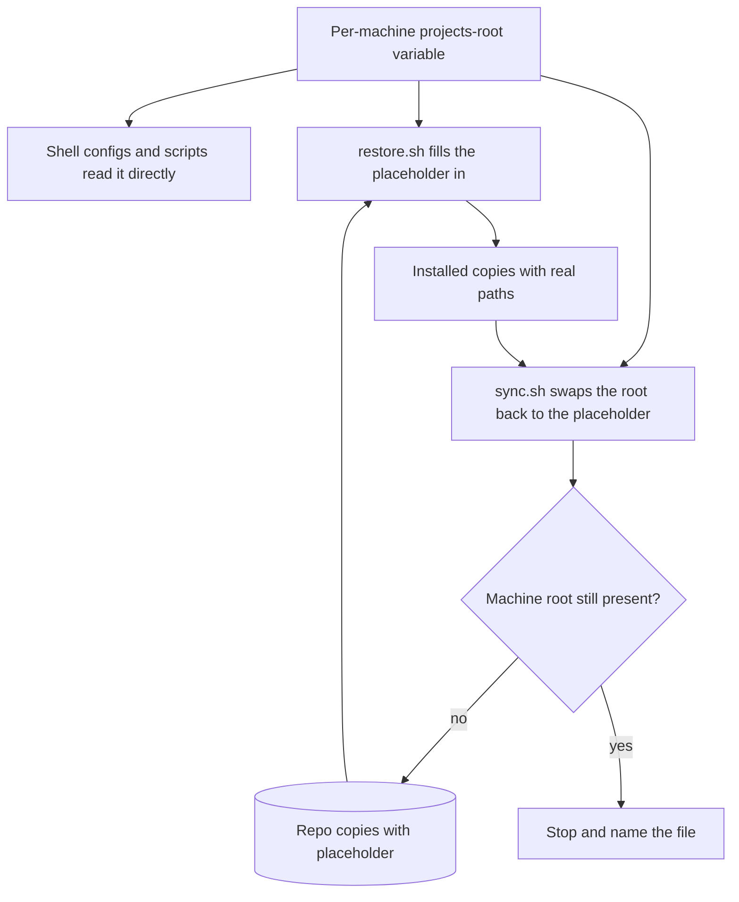
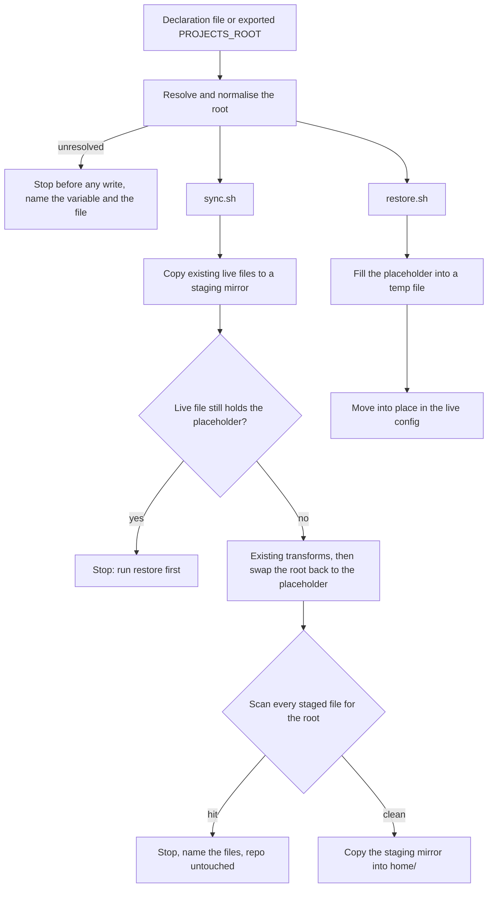

# Projects Root Variable - Plan

## Goal Capsule

- **Objective:** system_settings derives every project path from one per-machine projects-root variable, so the same repo restores and syncs correctly on the Dell (`~/Documents/Projects`) and the new CachyOS laptop (`~/Projects`).
- **Product authority:** this Product Contract. Decisions marked `session-settled` were made with the user in the brainstorm and are not reopened. When layers disagree, the R wins on behaviour and the KTD wins on mechanism.
- **Execution profile:** bash scripts and plain-bash test suites. Tests run on the Dell, except the fish suites, which need fish and run on the CachyOS laptop.
- **Stop conditions:** stop and report if a session-settled decision proves unworkable, if finishing a unit would require changing a live machine's config beyond the Operational Notes, or if the laptop is unreachable when the fish gates must run.
- **Tail ownership:** commit on `feat/cachyos-laptop`. Merge into `main` locally only after the pre-merge Dell steps and every Verification Contract gate pass, including the fish gates on the laptop (the user authorised the merge and asked for no PR). The user pushes.
- **Open blockers:** none.

---

## Product Contract

### Summary

Each machine sets its projects root once, as an environment variable. Shell configs and scripts read it directly. Files that cannot read variables are stored in the repo with a placeholder that restore fills in and sync swaps back, so the repo holds no machine's path and Claude and Codex still see real paths on each machine.

### Problem Frame

The new laptop keeps projects in `~/Projects`; the Dell keeps them in `~/Documents/Projects`. The repo hard-codes the Dell's location in 26 lines across 12 tracked files, plus two tests. `sync.sh` and `restore.sh` copy those files byte for byte, so restoring on the new laptop installs paths that point nowhere, and syncing from both machines would flip the same lines back and forth. Codex's per-project trust entries are keyed by absolute paths, and the Claude settings point a plugin source at an absolute path. `restore.sh` also never installs Claude's `settings.json` or `CLAUDE.md`, so a fresh machine already needs hand copying before paths even matter.

### Success Criteria

The user chose these four; the Key Decisions below cite them.

- **Restore needs no edits:** on a machine with a different root, `restore.sh` produces working configs with no hand-editing of paths.
- **Sync stays neutral:** running `sync.sh` on either machine never writes that machine's path into the repo.
- **Agents know the path:** the Claude and Codex instruction files tell the agent where projects, system_settings and the FNA session bus live on the current machine.
- **The Dell keeps working:** the Dell behaves as today once its variable is set.

### Key Decisions

- **One variable for the projects root.** The inner layout (`ActiveProjects/FNA`, `ActiveProjects/OWN`, `system_settings`) is the same on every machine, so only the root varies. (session-settled: user-directed — chosen over separate variables for the FNA and OWN folders: the layout stays the same under `~/Projects`.) Governs R1, R3.
- **Placeholder round trip for files that cannot read variables.** Restore fills the placeholder in and sync swaps it back, with a guard against leaking a machine path. (session-settled: user-approved — chosen over naming the variable in prose and making trust entries machine-local, and over linking `~/Documents/Projects` to `~/Projects`: it is the only option meeting all four success criteria.) Governs R7, R8, R9, R10.
- **A missing variable is an error, never a guess.** (session-settled: user-directed — chosen over a fixed default and over detecting whichever folder exists: guessing could silently use the wrong folder.) Governs R4, R5.
- **Codex trust entries travel with the repo.** They are re-pointed at the machine's root on restore instead of being re-granted per machine. (session-settled: user-approved — chosen over keeping them machine-local.) Governs R7, R8.
- **Restore installs the Claude configs.** "Restore needs no edits" requires `restore.sh` to install Claude's `settings.json` and `CLAUDE.md`, which it does not do today. (session-settled: user-approved — pulled into scope by the no-edits criterion.) Governs R11.

### Requirements

**The per-machine variable**

- R1. Each machine declares its projects root once, as an environment variable, and every project path in the repo derives from it.
- R2. The variable is visible to zsh and fish sessions, to `sync.sh` and `restore.sh`, and to Claude Code and Codex started from those shells.
- R3. Below the root, the layout is the same on every machine: `ActiveProjects/FNA`, `ActiveProjects/OWN` and `system_settings`.

**When the variable is missing**

- R4. When the variable is unset, `sync.sh` and `restore.sh` stop before changing anything and name the variable and where to set it.
- R5. When the variable is unset, shell startup skips the path-dependent steps with a one-line warning and loads everything else.

**Files that read the variable directly**

- R6. Shell configs and scripts (`home/.zshrc`, the fish functions, the i3 scripts) use the variable instead of a literal path.

**Files that cannot read variables**

- R7. The Claude `settings.json` and `CLAUDE.md`, the Codex `config.toml` and `AGENTS.md` for both accounts, and the Codex shared `MEMORY.md` are stored in the repo with a placeholder in place of the projects root.
- R8. `restore.sh` installs those files with the machine's projects root filled in, so installed copies hold real, working paths.
- R9. `sync.sh` replaces the machine's projects root with the placeholder before writing those files into the repo.
- R10. `sync.sh` stops without writing when any file it would write into the repo still contains the machine's literal projects root, and names that file.

**Restore completeness**

- R11. `restore.sh` installs the Claude `settings.json` and `CLAUDE.md` for both accounts, together with the hook scripts those settings call.

**Verification**

- R12. The drift check compares repo and installed copies after filling the placeholder in, so a correctly restored machine shows no drift.
- R13. Tests of path-dependent behaviour (the zsh sync check, the fish account wrappers) set their scratch root through the variable instead of hard-coding `~/Documents/Projects`.

**Continuity on the Dell**

- R14. With its variable set to `~/Documents/Projects`, the Dell behaves as it does today, with no other manual step.

### Acceptance Examples

- AE1. **Covers R8.** **Given** the new laptop with its root set to `~/Projects`, **when** `restore.sh` runs, **then** the installed Codex `config.toml` trusts `~/Projects/ActiveProjects/OWN/portwatch`, and no installed file contains `Documents/Projects`.
- AE2. **Covers R9.** **Given** both machines restored from the same commit, **when** each runs `sync.sh` with no config changes, **then** `git status` shows no changes to the files this plan converts or reads, on either machine.
- AE3. **Covers R10.** **Given** a live file outside the placeholder set that contains the machine's literal root, **when** `sync.sh` runs, **then** it stops, names that file, and leaves the repo unchanged.
- AE4. **Covers R4.** **Given** the variable is unset, **when** `restore.sh` runs, **then** it exits before copying anything and names the variable and where to set it.
- AE5. **Covers R5.** **Given** an SSH login where the variable is unset, **when** zsh starts, **then** it prints one warning line, skips the sync check and the terminal-title hook, and the prompt, aliases and account wrappers still load.
- AE6. **Covers R14.** **Given** the Dell with its variable set to `~/Documents/Projects`, **when** it runs `sync.sh`, **then** the repo holds placeholders only, and terminal titles and the sync check work as before.

Key Flows are omitted: sync and restore are single-pass copies, and AE1 to AE6 pin their conditional paths.

### Scope Boundaries

- Other repos, and Claude memory, that hard-code `~/Documents/Projects` stay as they are.
- The wider CachyOS and niri restore work (package lists, niri config, waybar) stays on its own track on this branch.
- Differences in username or home directory are not covered; both machines use the same home.
- The Dell's projects do not move.

#### Deferred to Follow-Up Work

- Deriving the zsh and fish account, theme and browser detection from the variable instead of the `*/Projects/ActiveProjects/{OWN,FNA}` suffix match (see Assumptions).
- Adding the Claude and Codex templated files to the drift check's file list.

### Dependencies / Assumptions

- Both machines use the same username and home directory, so the placeholder only needs to stand in for the projects root.
- The Claude hook scripts that `settings.json` calls are not tracked in the repo today; R11 brings them in.
- A fully clean `git status` after a laptop sync also needs the CachyOS package-list track. `sync.sh` rewrites one shared set of package lists from each machine's own pacman query, and the two distributions differ.

### Sources / Research

- `sync.sh:11`, `sync.sh:27-28`, `sync.sh:71`, `sync.sh:75-76`, `sync.sh:83-86` — plain copies of the affected files; the only transformations are the git identity scrub (`sync.sh:23-24`), the Claude `permissions.deny` filter and the preferences allowlist (`sync.sh:57-66`).
- `restore.sh:266-285` — the Claude step only merges `preferences.json` into `.claude.json`; `restore.sh:287-294` copies the Codex files verbatim.
- `home/codex/fna/config.toml:12`, `home/codex/own/config.toml:7` — trust entries keyed by absolute `/home/matteo/Documents/Projects/...` paths.
- `home/claude-code/own/settings.json:96`, `home/claude-code/fna/settings.json:100` — plugin directory source at an absolute path.
- `tests/datasave-mode.sh:567-584` — the byte-for-byte drift check; `project-launch` is not in its file list.
- `tests/mirror-rerank.sh:664-669` and `tests/fish-account-wrappers.sh:30-33` — tests that hard-code the path under a scratch home.

Product Contract preservation: changed: AE2 — limited to the files this plan converts or reads, because package lists belong to the CachyOS track; restructured, no scope change: added Success Criteria listing the four criteria the user chose. The Outstanding Questions the contract carried are resolved by KTD1, KTD2 and KTD3.

---

## Planning Contract

### Key Technical Decisions

- KTD1. **The variable is `PROJECTS_ROOT`.** `project-launch` keeps its script-local `PROJECTS_DIR` for the `ActiveProjects` folder, now derived as `$PROJECTS_ROOT/ActiveProjects`, so no name carries two meanings.
- KTD2. **One declaration file per machine: `~/.config/environment.d/50-projects-root.conf`.** It holds a single `PROJECTS_ROOT=${HOME}/...` line and is machine-local, never synced. The systemd user session reads it natively, so niri and everything it launches inherit the value. zsh, fish, `sync.sh`, `restore.sh` and `project-launch` read the same file when `PROJECTS_ROOT` is not already in their environment. This covers SSH and console logins and i3 on the Dell, whose session does not inherit `environment.d`. An exported `PROJECTS_ROOT` takes precedence over the file. Implements R1, R2, R4.
- KTD3. **The placeholder is the literal token `@PROJECTS_ROOT@`.** No shell, JSON or TOML parser expands it, and it is easy to grep. It stands for the absolute, normalised root.
- KTD4. **Normalise and validate the root once, at resolution.** Expand a leading `~`, `$HOME` and `${HOME}`, strip trailing slashes, and reject a relative result or one that is not an existing directory. `sync.sh` and `restore.sh` also stop when their own repo directory does not sit under the root, as R3 requires. A wrong but valid root would otherwise make swap and scan look for the wrong path and let the real one reach the repo unflagged. Every consumer works from the single normalised form.
- KTD5. **Swap-back recognises every spelling of the root, on path boundaries only.** Sync replaces the absolute form, the `~/` form and, when it differs, the symlink-resolved form, longest first. A match counts only when followed by `/`, end of line, or a character that cannot continue a path segment, so a sibling such as `~/ProjectsOld` is never rewritten. The two templated Markdown files use `~/`, the JSON and TOML use absolute paths, and a single-spelling swap would silently miss one side. Implements R9.
- KTD6. **The leak scan covers every file sync writes, not only the templated set.** It flags the root in every spelling KTD5 lists plus `$HOME/...` and `${HOME}/...`. The comments at `home/.zshrc:278` and `home/.config/i3/scripts/gcal-next:43` are rewritten so they pass it. Implements R10 and AE3.
- KTD7. **Sync stages everything, checks, then writes.** Sync copies every repo output into one temporary mirror of the repo: `home/`, `etc/`, `usr/local/bin/` and the `packages-*.txt` lists. It applies the existing transformations and the swap there, and scans all of it. It copies into the repo only when every check passes, so a stop leaves the repo untouched. The Claude `settings.json` jq filter fails the run instead of ending in `|| true`, and the swap runs on its output. Implements R9, R10.
- KTD8. **Sync refuses a live file that still holds `@PROJECTS_ROOT@`.** Such a file means restore never filled it in on this machine. Syncing it back would be a silent no-op that hides a broken install. The error tells the user to run restore.
- KTD9. **Sync skips a live source that does not exist on this machine,** and reports the skip without touching the repo copy. Without this, `sync.sh` fails on the laptop, which has no i3, polybar or picom files, and AE2 cannot hold.
- KTD10. **Restore installs Claude config unconditionally.** `settings.json`, `CLAUDE.md`, `statusline.sh`, `title-hook.sh` and the hooks install whether or not the account has logged in yet. Only the `preferences.json` merge stays behind the existing "log in first" gate. The credential hook fails closed without its path list and blocks every tool call, so it must arrive together with the settings that call it. The hook also needs `jq`, so `restore_claude` stops with a message naming `jq` before installing anything when it is missing. Implements R11.
- KTD11. **The hooks live once in the repo.** `home/claude-code/hooks/` holds `protect-credentials.sh`, `protect-credentials.test.sh` and `protected-paths.txt`. Restore installs them into `~/.claude-fna/hooks/` and links each `~/.claude-own/hooks/` entry to its FNA counterpart, mirroring today's live layout. `protect-credentials.test.sh` hard-codes a Dell project path in its `proj` fixture (line 10); it is rewritten to a neutral path under the test's own scratch home that no protected glob matches, in the repo copy and the live Dell copy. After that no hook file contains a projects path, and they copy without a placeholder. Implements R11.
- KTD12. **Filled files are written to a temporary file and moved into place,** so a failed fill never leaves a half-written config. Implements R8.
- KTD13. **Shell warnings print only in interactive terminal shells.** The zsh loader reuses the repo's `[[ -o interactive && -t 0 ]]` guard; the fish loader uses `status is-interactive`. Claude Code snapshots `.zshrc` into non-interactive tool shells, so a warning there would be noise, and a prompt there would hang. Implements R5.
- KTD14. **A new `fish` restore component** installs `home/.config/fish/functions/claude.fish`, `codex.fish` and `home/.config/fish/conf.d/projects-root.fish`. Sync copies back only those three tracked files when present, never the whole functions directory, so functions local to the laptop stay out of the repo. Implements R2 on the laptop.
- KTD15. **Example values never use a real root.** Resolver and loader messages, and any synced file, show `PROJECTS_ROOT=${HOME}/path/to/projects`. Either machine's real value inside a synced file would trip that machine's own leak scan. The real per-machine values appear only in `docs/projects-root.md`.

### High-Level Technical Design

The same library supplies resolve, fill, swap and scan to both scripts. The drift check uses its fill step before comparing.

### Assumptions

These are planning bets made without user confirmation.

- Account, theme and browser detection keep matching `*/Projects/ActiveProjects/{OWN,FNA}`. That works only while the root's last component is `Projects`, which holds on both machines. Moving it onto the variable is listed under Deferred to Follow-Up Work.
- The drift check becomes placeholder-aware and gains `project-launch`, but its file list does not grow to include the Claude and Codex configs. Those change often, and adding them would raise false alarms.
- Codex trust entries for directories outside the projects root stay machine-specific literal paths. With a shared home, they do not break the other machine.
- Neither machine's root is a symlink today. KTD5's resolved-path spelling guards against one appearing later.
- Account-detection text that already uses the suffix form (`docs/codex-accounts.md`, the `AGENTS.md` and `MEMORY.md` account notes) needs no placeholder.

---

## Implementation Units

### U1. Projects-root library

**Goal:** one sourced shell library that resolves the root and performs fill, swap and scan.

**Requirements:** R1, R4, R9, R10; KTD1, KTD2, KTD3, KTD4, KTD5, KTD6.

**Dependencies:** none.

**Files:**
- `lib/projects-root.sh` (new)
- `tests/projects-root.sh` (new)

**Approach:**
1. Resolve: use a non-empty exported `PROJECTS_ROOT`, else the last `PROJECTS_ROOT=` line of the declaration file, skipping comments. Normalise per KTD4.
2. On failure, print one message naming `PROJECTS_ROOT`, the declaration file, and the KTD15 example line, and return non-zero. Callers decide whether to exit.
3. Fill replaces `@PROJECTS_ROOT@` literally. Roots with spaces or regex characters must survive unchanged.
4. Swap applies KTD5. Scan applies KTD6 and reports placeholder tokens separately, for KTD8.

**Patterns to follow:** error style of `restore.sh:98-101` (`echo "ERROR: ..." >&2`). The test layout mirrors `tests/fish-account-wrappers.sh`: `REPO_ROOT` from the script path, a `mktemp` scratch `HOME`, and `pass`/`fail` counters.

**Execution note:** implement test-first. The library has no callers yet, so its behaviour is easiest to pin in isolation.

**Test scenarios:**
- Exported `PROJECTS_ROOT=/x/Work/` resolves to `/x/Work`.
- No export, declaration file `PROJECTS_ROOT=${HOME}/Projects`: resolves to `$HOME/Projects`.
- `$HOME` and a leading `~` in the file both expand.
- An exported value wins over the declaration file.
- A commented-out line in the file is ignored.
- No export and no file: non-zero status, and the message names `PROJECTS_ROOT` and the file path.
- A relative value such as `Projects`: non-zero status with the same kind of message.
- An absolute value naming a directory that does not exist: non-zero status.
- The failure message's example line contains `path/to/projects`, and neither machine's real root.
- Fill with a root containing a space and a basename other than `Projects` (`/tmp/a b/Work`): the output holds that exact path.
- Swap turns `/r/Work/x`, `~/Work/x` (root under `HOME`) and `"/r/Work"` inside JSON quotes into the placeholder.
- Swap leaves `/r/WorkOld/x` and `/r/Work2` untouched.
- Swap followed by fill reproduces the original file byte for byte.
- Scan flags the absolute, `~/`, `$HOME/` and `${HOME}/` spellings, and passes a file holding only placeholders.
- Scan's placeholder mode flags a file still holding `@PROJECTS_ROOT@`.

**Verification:** `tests/projects-root.sh` library section passes, and the library has no side effects when sourced.

### U2. sync.sh staging, swap and leak guard

**Goal:** sync writes machine-neutral content or nothing.

**Requirements:** R4, R9, R10, AE2, AE3, AE6; KTD6, KTD7, KTD8, KTD9, KTD11, KTD14.

**Dependencies:** U1, U5.

**Files:**
- `sync.sh`
- `tests/projects-root.sh`

**Approach:**
1. Source `lib/projects-root.sh`, resolve before any copy, check that the repo sits under the root (KTD4), and exit on failure.
2. Redirect every copy into one staging mirror of the repo, covering every output KTD7 lists.
3. Skip live sources that do not exist, per KTD9.
4. Apply the existing git-identity, jq and preferences transforms in staging; the jq step fails the run.
5. Refuse live templated sources holding the placeholder (KTD8). Swap the R7 set, then scan every staged file.
6. On success, copy staging into the repo.
7. Add the hooks directory and the three tracked fish files (KTD14) to the copied set.

**Execution note:** build the scratch repo for tests as a plain copy with a fresh `git init`, never a copy of this worktree. A copied worktree's `.git` file points at the real gitdir, and the `git status` at the end of `sync.sh` would touch the real index.

**Patterns to follow:** the existing per-account loops at `sync.sh:56`, `sync.sh:70` and `sync.sh:82` stay the organising structure; they point at staging instead of `home/`.

**Test scenarios:**
- Covers AE2. A scratch repo copy plus a scratch `HOME` holding filled copies of the templated files for root `/tmp/a b/Work`: sync leaves the templated repo files byte-identical.
- The same fixture with root `/tmp/c/Projects`: again no change, so two machines with different roots do not flip-flop.
- Covers AE3. A live `.zshrc` containing the literal root: sync exits non-zero, names `.zshrc`, and the scratch repo is unchanged.
- A live `settings.json` still holding `@PROJECTS_ROOT@`: sync exits non-zero and tells the user to run restore.
- A missing live source (no i3 config in scratch `HOME`): sync reports the skip, succeeds, and the repo's i3 copy is unchanged.
- A jq failure on `settings.json` (invalid JSON): sync exits non-zero and the repo copy is unchanged.
- `PROJECTS_ROOT` unset and no declaration file: sync exits non-zero before creating the staging mirror.
- A root that exists but does not contain the scratch repo: sync exits non-zero before copying anything.
- A leak stop with the package-list step included: the scratch repo's `packages-*.txt`, `etc/` and `usr/local/bin/` are unchanged.
- Extra fish functions in the scratch `HOME` beyond the three tracked files: they do not appear in the scratch repo.

**Verification:** `tests/projects-root.sh` sync section passes, and the "Live sync is neutral" gate passes after the pre-merge Dell steps in the Operational Notes.

### U3. restore.sh fill-in and Claude installation

**Goal:** a fresh machine gets working Claude and Codex configs with real paths and no hand edits.

**Requirements:** R4, R8, R11, AE1, AE4; KTD10, KTD11, KTD12, KTD14.

**Dependencies:** U1, U5.

**Files:**
- `restore.sh`
- `tests/projects-root.sh`

**Approach:**
1. Source the library. Resolve right after argument parsing, before `install_packages` and any component; only the `--help` and `--list-components` exits stay ahead of it. Check that the repo sits under the root (KTD4). On failure, exit before any write.
2. `restore_claude` installs, per account, filled `settings.json` and `CLAUDE.md`, plus `statusline.sh` and `title-hook.sh`, and the hooks per KTD11, independently of login state (KTD10).
3. `restore_codex` fills `config.toml`, `AGENTS.md` and the shared `MEMORY.md` instead of copying them.
4. Add the `fish` component to both component arrays and to the help output.

**Patterns to follow:** the component function and array registration at `restore.sh:20-60` and the dispatch in `run_component` at `restore.sh:333-342`.

**Test scenarios:**
- Covers AE1. Restore `claude,codex` into a scratch `HOME` with root `/tmp/a b/Work`: the installed Codex `config.toml` contains `[projects."/tmp/a b/Work/ActiveProjects/OWN/portwatch"]`.
- After that restore, no installed file contains `@PROJECTS_ROOT@` or `Documents/Projects`.
- Covers AE4. `PROJECTS_ROOT` unset and no declaration file: restore exits non-zero, names the variable and the file, and creates nothing under the scratch `HOME`.
- No `.claude.json` in the scratch `HOME`: `settings.json`, `CLAUDE.md` and the hooks are installed, and the preferences merge reports "log in first".
- The installed `~/.claude-own/hooks/` entries are links to `~/.claude-fna/hooks/`, and `protected-paths.txt` is readable through them.
- Restore `fish` installs `functions/claude.fish`, `functions/codex.fish` and `conf.d/projects-root.fish`.
- `--list-components` works with `PROJECTS_ROOT` unset.
- A bare `restore.sh` with `PROJECTS_ROOT` unset: it exits before the package step starts, with the package manager stubbed so the test can detect any call.
- `jq` absent from `PATH`: `restore_claude` exits non-zero naming `jq`, and installs no hook.

**Verification:** `tests/projects-root.sh` restore section passes.

### U4. Shell and script consumers

**Goal:** zsh, fish and the i3 scripts use `PROJECTS_ROOT`, and degrade quietly when it is missing.

**Requirements:** R2, R5, R6, R13, R14, AE5, AE6; KTD2, KTD6, KTD13, KTD14.

**Dependencies:** none. The loaders implement KTD2's file read themselves, because installed shells cannot source a repo file.

**Files:**
- `home/.zshrc`
- `home/.config/fish/conf.d/projects-root.fish` (new)
- `home/.config/i3/scripts/project-launch`
- `home/.config/i3/scripts/gcal-next`
- `tests/mirror-rerank.sh`
- `tests/fish-account-wrappers.sh`
- `tests/fish-projects-root.sh` (new)

**Approach:**
1. In `.zshrc`, near the top: a named loader function exports `PROJECTS_ROOT` from the declaration file when it is unset, and warns once per KTD13 when it cannot be resolved. Keeping it a named function lets tests extract it the way `tests/mirror-rerank.sh` extracts the sync check.
2. `_settings_sync_check` uses `$PROJECTS_ROOT/system_settings` and returns early when unset. When `sync.sh` exits non-zero, it returns without the git check and without writing the stamp, so a stopped sync prompts again at the next terminal.
3. The `terminal-title.zsh` source becomes guarded on the root being set and the file existing. The comment at `.zshrc:278` names the variable.
4. `projects-root.fish` mirrors the zsh loader with `set -gx`.
5. `project-launch` resolves `PROJECTS_ROOT` from the environment or the declaration file and derives `PROJECTS_DIR`. It exports the resolved value into the Claude session it starts, which does not pass through a shell. When unresolved, it reports through `notify-send`, as it already does for a missing project, and on stderr, then exits non-zero.
6. The `gcal-next:43` comment points at the example file by its repo-relative path.
7. In `tests/mirror-rerank.sh` and `tests/fish-account-wrappers.sh`, set `PROJECTS_ROOT` in the scratch environment and build fixture paths from it.

**Patterns to follow:** the guarded-source idiom at `home/.zshrc:41` and `home/.zshrc:288`; the interactive guard at `home/.zshrc:198`.

**Test scenarios:**
- Scratch `HOME` with a declaration file and no export: an interactive `zsh -i` exports the normalised `PROJECTS_ROOT`.
- Covers AE5. No declaration file: the extracted loader, run in an interactive zsh under a pseudo-terminal, prints exactly one warning line and returns zero, so the rest of `.zshrc` would still load.
- `sync.sh` stubbed to exit non-zero: the sync check writes no stamp and prints no "No changes detected".
- No declaration file: `zsh -c true` prints nothing and exits promptly.
- The sync check reads its stamp from `$PROJECTS_ROOT/system_settings/.last_sync` (the updated `tests/mirror-rerank.sh` fixture).
- fish, declaration file present: `fish -c 'echo $PROJECTS_ROOT'` prints the root.
- fish, export present: the exported value wins.
- fish, no file: an interactive fish warns once, and `fish -c true` prints nothing.
- The fish account-wrapper suite still passes with fixtures under `$PROJECTS_ROOT/ActiveProjects`.
- `project-launch`, declaration file present and no export: it lists projects under `$PROJECTS_ROOT/ActiveProjects`, with `rofi` stubbed.
- `project-launch`, nothing resolvable: it exits non-zero, and a stubbed `notify-send` receives the resolver message.
- `project-launch` with a stubbed `kitty`: the launched command carries `PROJECTS_ROOT`.

**Verification:** `tests/mirror-rerank.sh` passes on the Dell; `tests/fish-account-wrappers.sh` and `tests/fish-projects-root.sh` pass on the laptop; `zsh -n home/.zshrc` is clean.

### U5. Convert tracked files, track the hooks, make the drift check placeholder-aware

**Goal:** the repo holds placeholders and the hooks, and the drift check understands both.

**Requirements:** R7, R11, R12; KTD3, KTD5, KTD11.

**Dependencies:** U1.

**Files:**
- `home/claude-code/own/settings.json`, `home/claude-code/fna/settings.json`
- `home/claude-code/own/CLAUDE.md`, `home/claude-code/fna/CLAUDE.md`
- `home/codex/own/config.toml`, `home/codex/fna/config.toml`
- `home/codex/own/AGENTS.md`, `home/codex/fna/AGENTS.md`
- `home/codex/shared/MEMORY.md`
- `home/claude-code/hooks/protect-credentials.sh`, `home/claude-code/hooks/protect-credentials.test.sh`, `home/claude-code/hooks/protected-paths.txt` (new)
- `tests/datasave-mode.sh`

**Approach:**
1. Rewrite the 21 root occurrences in the nine templated files to `@PROJECTS_ROOT@`, using U1's swap against the Dell's root so the conversion matches what sync will produce.
2. Copy the three hook files from the Dell's `~/.claude-fna/hooks/`, then rewrite the `proj` fixture in `protect-credentials.test.sh` per KTD11. Apply the same edit to the live Dell copy (Operational Notes, before merge).
3. In the drift check, fill the repo copy before comparing, and add `project-launch` to its file list.

**Test scenarios:**
- `git grep -n 'Documents/Projects' -- home sync.sh restore.sh lib` returns nothing.
- The nine templated files together hold 21 placeholders, one per replaced occurrence.
- Each converted JSON file still parses with `jq`, and each TOML file keeps its section and key count.
- Drift check with a live file equal to the filled repo copy: no drift.
- Drift check with a live file differing from the filled repo copy by one line: drift is reported.
- `protect-credentials.test.sh`, run from the repo copy, passes.

**Verification:** `tests/datasave-mode.sh` passes on the Dell once the updated `project-launch` and `gcal-next` are installed live (Operational Notes).

### U6. Documentation

**Goal:** a future reader can declare the root on a new machine and knows how templated files behave.

**Requirements:** R1, R4, R7.

**Dependencies:** U2, U3, U4.

**Files:**
- `docs/projects-root.md` (new)
- `docs/codex-accounts.md`

**Approach:**
1. Document the declaration file and an example line for each machine.
2. Explain the error messages and the placeholder round trip.
3. Give the steps for adding a new templated file.
4. Update the sync and restore paragraph in `docs/codex-accounts.md`.

**Test expectation:** none -- documentation only.

**Verification:** every path and command in the new doc exists in the repo.

---

## Verification Contract

| Gate | Command | Where | Proves |
|---|---|---|---|
| Library, sync and restore | `bash tests/projects-root.sh` | Dell | U1, U2, U3 |
| zsh sync check | `bash tests/mirror-rerank.sh` | Dell | U4 (zsh) |
| Drift and data-saving mode | `bash tests/datasave-mode.sh` | Dell, after the pre-merge live steps | U5 |
| Session layout (regression) | `bash tests/session-layout-roundtrip.sh` | Dell | unchanged behaviour |
| fish wrappers and loader | `bash tests/fish-account-wrappers.sh` and `bash tests/fish-projects-root.sh`, run from a scratch copy of the branch's `tests/` and `home/.config/fish/` | CachyOS laptop, before the merge | U4 (fish) |
| Syntax | `bash -n` on `sync.sh`, `restore.sh`, `lib/projects-root.sh`, `project-launch`; `zsh -n home/.zshrc`; `fish -n` on the fish files (laptop) | both | all shell units |
| No literal root left | `git grep -n 'Documents/Projects' -- home sync.sh restore.sh lib` returns nothing | Dell | R1, R7 |
| Live sync is neutral | `sync.sh` on the Dell with its declaration file, then `git status` on the files this plan converts or reads | Dell, after the pre-merge live steps | AE2, AE6 |

Run `shellcheck` on the changed shell files when it is installed; fix or justify every finding inline.

## Definition of Done

- Every unit's test scenarios pass, and every gate in the Verification Contract passes.
- R1 to R14 hold, and AE1 to AE6 are demonstrated by the named tests or gates.
- No tracked file under `home/`, `sync.sh`, `restore.sh` or `lib/` contains `Documents/Projects`.
- Code from abandoned approaches is removed from the diff.
- The pre-merge Dell steps are done, and the fish gates passed on the laptop.
- The work is committed on `feat/cachyos-laptop` and merged into `main` locally; the user pushes.

## Operational Notes

**Before the merge, on the Dell** (the new `sync.sh` refuses to run while live files still hold the literal root, so this cannot wait):

1. Diff the live `~/.zshrc`, `~/.config/i3/scripts/project-launch` and `~/.config/i3/scripts/gcal-next` against their versions at the branch's base commit. Fold any unsynced live edit into the branch.
2. Create `~/.config/environment.d/50-projects-root.conf` with `PROJECTS_ROOT=${HOME}/Documents/Projects`, then open a new shell.
3. Install the branch's `.zshrc`, `project-launch` and `gcal-next` live, and apply KTD11's fixture edit to the live `~/.claude-fna/hooks/protect-credentials.test.sh`.
4. Run the "Live sync is neutral" and drift gates.

**After the merge, on the laptop:**

1. Create `~/.config/environment.d/50-projects-root.conf` with `PROJECTS_ROOT=${HOME}/Projects`, then open a new shell. The graphical session picks the value up at the next login.
2. With `system_settings` in `~/Projects`, run `restore.sh --components shell-desktop,claude,codex,fish`.

**On both machines:** check that a Claude session sees the variable; its Bash tool should print the root for `echo $PROJECTS_ROOT`.
